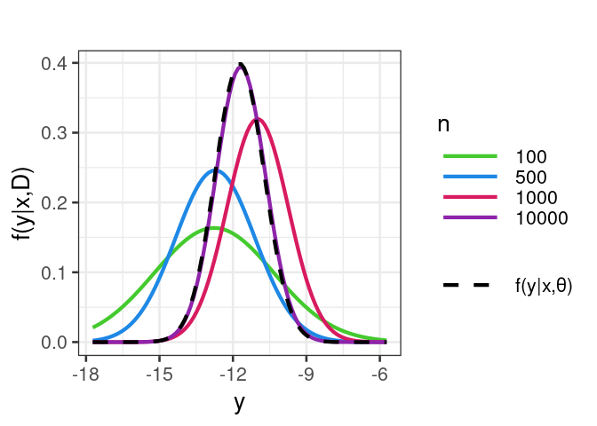

Bayesian Density Concentration
================
Rafael Izbicki

This notebook is part of the book “Machine Learning Beyond Point
Predictions: Uncertainty Quantification”, by Rafael Izbicki.

# Introduction

This notebook demonstrates how the Bayesian predictive density
concentrates around the true conditional density $f(y|x)$ as the sample
size increases. We use a homoscedastic Gaussian linear regression model.

``` r
library(tidyverse)
library(glmnet)
library(mvtnorm)
library(extraDistr)
library(rsample)
theme_set(theme_bw(base_size = 20))
```

## Generating Homoscedastic Gaussian Data

``` r
generate_hom_gaussian <- function(n,d,x=NULL)
{
  if(is.null(x))
  {
    x=matrix(runif(n*d,-5,5),n,d)
  }
  # response
  mean_g <- 5*x[,1]
  sd_g <- 1
  y=mean_g+rnorm(nrow(x),0,sd_g)
  return(list(x=x,y=y,mean=mean_g,sd=sd_g))
}
```

## Fitting Bayesian Regression Model

``` r
fit_bayes <- function(xTrain,yTrain,a,b,gamma_0)
{
  mu_0 <- rep(0,ncol(xTrain))
  reescale_factor <- mean(yTrain)
  yTrain <- yTrain-reescale_factor
  Gamma_0 <- diag(gamma_0,ncol(xTrain))
  a_star <- a+nrow(xTrain)/2
  Gamma_star <- t(xTrain)%*%xTrain+Gamma_0
  mu_star <- solve(Gamma_star)%*%(Gamma_0%*%mu_0+t(xTrain)%*%yTrain)
  b_star <- b+(t(yTrain)%*%yTrain + t(mu_0)%*% Gamma_0%*%mu_0- t(mu_star)%*%Gamma_star%*%mu_star )/2
  output <- list(a_star=a_star,
                 Gamma_star=Gamma_star,
                 mu_star=mu_star,
                 b_star=b_star,
                 reescale_factor=reescale_factor)
  class(output) <- "fitbayes"
  return(output)
}
```

## Bayesian Regression with Cross-Validation to choose hyperparameters

``` r
bayesian_regression_cv <- function(xTrain,yTrain,
                                   a_0=0.00001,
                                   b_0=1,nFolders=10,gamma_0_grid=seq(0.001,100,length.out=100))
{
  mse <- rep(NA,length(gamma_0_grid))
  cv <- vfold_cv(xTrain, v = nFolders)
  predictions <- rep(NA,length(yTrain))
  for(gg in 1:length(mse))
  {
    for(folder in 1:nFolders)
    {
      fit <- fit_bayes(xTrain[cv$splits[[folder]]$in_id,],yTrain[cv$splits[[folder]]$in_id],
                       a_0,b_0,gamma_0_grid[gg])
      predictions[-cv$splits[[folder]]$in_id] <- predict(fit,xTrain[-cv$splits[[folder]]$in_id,])$pred
    }
    mse[gg] <- mean((predictions-yTrain)^2)  
  }
  gamma_0 <- gamma_0_grid[which.min(mse)[1]]
  fit <- fit_bayes(xTrain,yTrain,a_0,b_0,gamma_0)
  
  output <- list(a_star=fit$a_star,
                 Gamma_star=fit$Gamma_star,
                 mu_star=fit$mu_star,
                 b_star=fit$b_star,
                 reescale_factor=fit$reescale_factor,
                 a_0=a_0,
                 b_0=b_0,
                 gamma_0=gamma_0,
                 mse=mse)
  class(output) <- "fitbayes"
  return(output)
}
```

## Predicting with Bayesian Regression Model

``` r
predict.fitbayes <- function(fit,xNew,alpha=0.1)
{
  pred=fit$reescale_factor+xNew%*%fit$mu_star
  cov=as.numeric(fit$b_star/fit$a_star)*
    (diag(1,nrow(xNew))+xNew%*%solve(fit$Gamma_star)%*%t(xNew))
  lower <- qlst(alpha/2, df=2*fit$a_star, 
                mu = as.numeric(pred), 
                sigma = sqrt(diag(cov)))
  upper <- qlst(1-alpha/2, df=2*fit$a_star, 
                mu = as.numeric(pred), 
                sigma = sqrt(diag(cov)))
  return(list(pred=pred,
              cov=cov,
              lower=lower,
              upper=upper)
  )
}
```

## Running the Simulation

``` r
run_simulation <- function(seed) {
  set.seed(seed)  # Set the seed
  
  d <- 65
  l <- 10  # prior hyperparameter
  alpha <- 0.1  # 1-alpha is the nominal coverage of the prediction sets
  simulator <- generate_hom_gaussian
  
  n_test <- 1
  data_test <- simulator(n_test, d)
  pred_oracle <- data.frame(pred = data_test$mean,
                            lower = qnorm(alpha / 2, data_test$mean, , data_test$sd),
                            upper = qnorm(1 - alpha / 2, data_test$mean, , data_test$sd))
  
  n_values <- c(100, 500,1000, 10000)
  combined_df_all <- tibble()
  
  for (n in n_values) {
    print(n)
    
    data_train_and_val <- simulator(n, d)
    ids <- sample(c("train", "val"), size = n, prob = c(0.7, 0.3), replace = TRUE)
    xTrain <- data_train_and_val$x[ids == "train", ]
    yTrain <- data_train_and_val$y[ids == "train", drop = FALSE]
    xVal <- data_train_and_val$x[ids == "val", ]
    yVal <- data_train_and_val$y[ids == "val", drop = FALSE]
    
    # Bayes
    gamma_0_grid <- l
    fitted_bayes <- bayesian_regression_cv(data_train_and_val$x, data_train_and_val$y, gamma_0_grid = gamma_0_grid)
    pred_bayes <- predict(fitted_bayes, data_test$x, alpha = alpha)
    
    # Store pred and cov in a dataframe
    pred_df <- data.frame(n = n, 
                          pred = pred_bayes$pred, 
                          cov = pred_bayes$cov)
    
    # Combine into the main dataframe
    combined_df_all <- bind_rows(combined_df_all, pred_df)
    
  }
  
  # Define a range for the x-values
  x_values <- seq(data_test$mean-6*data_test$sd, data_test$mean+6*data_test$sd, length.out = 100)
  
  # Expand the dataframe so that each row in combined_df_all corresponds to 100 x-values
  plot_data <- combined_df_all %>%
    rowwise() %>%
    do(data.frame(n = .$n, pred = .$pred, cov = .$cov, x = x_values)) %>%
    mutate(density = dnorm(x, mean = pred, sd = sqrt(cov)))
  
  # Generate true distribution data
  true_density <- data.frame(x = x_values,
                             density = dnorm(x_values, mean = data_test$mean, sd = data_test$sd),
                             distribution = "f(y|x,θ)") # Add a column for labeling in legend
  
  # Define custom colors
  custom_colors <- c("#44CA2E", "#1E88E5", "#D81B60",   "#8E24AA")
  
  # Now create the ggplot with the true distribution in black
  g <- ggplot(plot_data, aes(x = x, y = density, color = as.factor(n))) +
    geom_line(size = 1.5) +
    # Add true distribution in black with label
    geom_line(data = true_density, aes(x = x, y = density, linetype = distribution), 
              color = "#000000", size = 1.5) +
    labs(title = "",
         x = "y",
         y = "f(y|x,D)",
         color = "n") +
    theme(strip.background = element_blank(),  # Remove grey facet boxes
          strip.text = element_text(size = 22, face = "bold"),
          panel.spacing.x = unit(4, "lines")) +
    scale_color_manual(values = custom_colors) +
    scale_linetype_manual(name = NULL, values = c("f(y|x,θ)" = "dashed")) +
    guides(linetype = guide_legend(override.aes = list(color = "#000000"), title = NULL)) +
    theme(legend.key.width = unit(2, "cm"))
  
  g
}
```

## Run the Simulation

``` r
run_simulation(1)
```

    ## [1] 100
    ## [1] 500
    ## [1] 1000
    ## [1] 10000

<!-- -->
