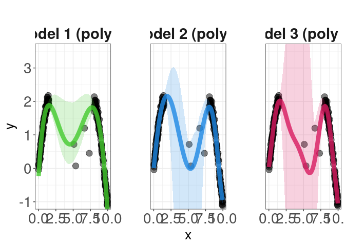

Bootstrap
================
Rafael Izbicki
2024-09-16

This notebook is part of the book “Machine Learning Beyond Point
Predictions: Uncertainty Quantification”, by Rafael Izbicki.

## Introduction

This analysis uses bootstrap resampling to generate epistemic
uncertainty intervals for polynomial regression models. The data
consists of two dense regions and one sparse region, with a non-linear
sine function generating the response variable ($y$) and added noise in
the middle region.

We fit polynomial models of degrees 5, 8, and 10 to the data and apply
bootstrap to estimate prediction uncertainty.

## Data Generation and True Function

``` r
# Set seed for reproducibility
set.seed(2)

# Generate data: two regions with dense data and a middle region with sparse data
x_dense1 <- runif(100, min = 0, max = 1.5)
x_dense2 <- runif(100, min = 8, max = 10)
x_middle <- runif(4, min = 1.5, max = 7.5)
x_sparse <- c(x_dense1, x_dense2, x_middle)

# Define true function for y given x
true_function <- function(x) {
  y <- 2 * sin(x) + rnorm(length(x), sd = 0.1)
  # Add higher variance in the middle region
  y[2 < x & x < 7.5] <- y[2 < x & x < 7.5] + rnorm(sum(2 < x & x < 7.5), sd = 2)
  return(y)
}

# Generate y based on the true function
y_dense <- true_function(x_sparse)

# Create a dataframe to hold the data
data <- data.frame(x = x_sparse, y = y_dense)

# Define a grid of x values for prediction
x_grid <- seq(min(x_sparse), max(x_sparse), length.out = 200)
```

## Bootstrap Function for Predictions

``` r
# Define function to perform bootstrap for predictive intervals
bootstrap_predictions <- function(data, x_grid, model_formula, n_bootstrap = 1000) {
  # Initialize matrix to hold bootstrap predictions
  preds <- matrix(NA, nrow = length(x_grid), ncol = n_bootstrap)
  
  # Loop over the number of bootstrap samples
  for (i in 1:n_bootstrap) {
    # Sample data with replacement
    boot_sample <- data[sample(1:nrow(data), replace = TRUE), ]
    
    # Fit regression model to the bootstrap sample
    model <- lm(model_formula, data = boot_sample)
    
    # Predict y values on the grid of x values
    preds[, i] <- predict(model, newdata = data.frame(x = x_grid))
  }
  
  # Calculate mean prediction and confidence intervals
  pred_mean <- apply(preds, 1, mean)
  lower_bound <- apply(preds, 1, function(x) quantile(x, 0.025))
  upper_bound <- apply(preds, 1, function(x) quantile(x, 0.975))
  
  return(data.frame(x_grid = x_grid, pred_mean = pred_mean, lower_bound = lower_bound, upper_bound = upper_bound))
}
```

## Apply Bootstrap to Models with Different Polynomial Degrees

``` r
# Generate bootstrap predictions for three models with different polynomial degrees
predictions1 <- bootstrap_predictions(data, x_grid, y ~ poly(x, 5))
predictions2 <- bootstrap_predictions(data, x_grid, y ~ poly(x, 8))
predictions3 <- bootstrap_predictions(data, x_grid, y ~ poly(x, 10))
```

## Combine Predictions and Plot

``` r
# Combine predictions from all three models into one dataframe for plotting
predictions_combined <- bind_rows(
  data.frame(x_grid = predictions1$x_grid, pred_mean = predictions1$pred_mean,
             lower_bound = predictions1$lower_bound, upper_bound = predictions1$upper_bound, model = "Model 1 (poly 5)"),
  data.frame(x_grid = predictions2$x_grid, pred_mean = predictions2$pred_mean,
             lower_bound = predictions2$lower_bound, upper_bound = predictions2$upper_bound, model = "Model 2 (poly 8)"),
  data.frame(x_grid = predictions3$x_grid, pred_mean = predictions3$pred_mean,
             lower_bound = predictions3$lower_bound, upper_bound = predictions3$upper_bound, model = "Model 3 (poly 10)")
)

# Define custom colors for models
custom_colors <- c("Model 1 (poly 5)" = "#44CA2E", 
                   "Model 2 (poly 8)" = "#1E88E5", 
                   "Model 3 (poly 10)" = "#D81B60")

# Create ggplot with faceting for each model and custom colors
g <- ggplot() +
  # Add data points
  geom_point(data = data, aes(x = x, y = y), alpha = 0.5, color = "black", size = 4) +
  
  # Add prediction lines and confidence intervals
  geom_line(data = predictions_combined, aes(x = x_grid, y = pred_mean, color = model), size = 3, alpha = 0.8) +
  geom_ribbon(data = predictions_combined, aes(x = x_grid, ymin = lower_bound, ymax = upper_bound, fill = model), alpha = 0.2) +
  
  # Facet by model
  facet_wrap(~ model) +
  
  # Set custom colors for lines and ribbons
  scale_color_manual(values = custom_colors) +
  scale_fill_manual(values = custom_colors) +
  
  # Customize theme
  theme_bw() +
  labs(title = "", x = "x", y = "y") +
  theme(text = element_text(size = 14),
        axis.text = element_text(size = 16),
        legend.key.width = unit(2, "cm"), legend.position = "none",
        strip.background = element_blank(),  # Remove grey facet boxes
        strip.text = element_text(size = 18, face = "bold"),
        panel.spacing.x = unit(4, "lines")) +
  coord_cartesian(xlim = range(x_sparse), ylim = c(-1, 3.5))
```

    ## Warning: Using `size` aesthetic for lines was deprecated in ggplot2 3.4.0.
    ## ℹ Please use `linewidth` instead.
    ## This warning is displayed once every 8 hours.
    ## Call `lifecycle::last_lifecycle_warnings()` to see where this warning was
    ## generated.

``` r
# Display the plot
g
```

<!-- -->
