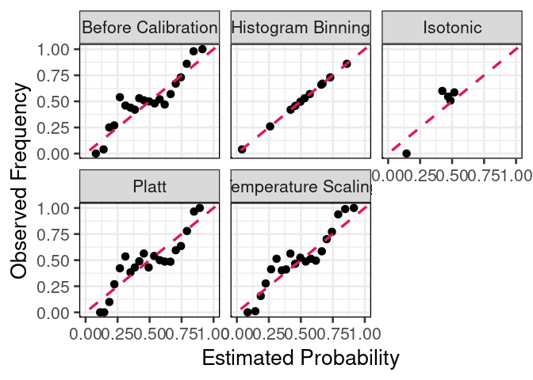
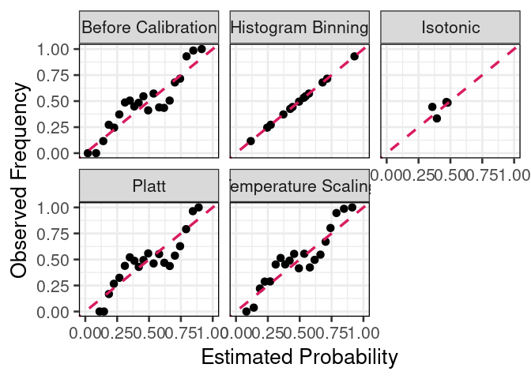

Calibration Methods: Logistic Regression
================
Rafael Izbicki
2024-09-27

This notebook is part of the book “Machine Learning Beyond Point
Predictions: Uncertainty Quantification”, by Rafael Izbicki.

## Introduction

This R Markdown document demonstrates how to apply various calibration
methods to a logistic regression model. We will generate synthetic
training and validation datasets, train a logistic regression model, and
then apply isotonic regression, Platt scaling, histogram binning, and
temperature scaling to calibrate the model’s predictions. The
calibration quality will be evaluated using metrics such as the Brier
score and log loss.

``` r
knitr::opts_chunk$set(echo = TRUE, warning = FALSE, message = FALSE, error = FALSE)


library(ggplot2)
library(dplyr)
```

    ## 
    ## Attaching package: 'dplyr'

    ## The following objects are masked from 'package:stats':
    ## 
    ##     filter, lag

    ## The following objects are masked from 'package:base':
    ## 
    ##     intersect, setdiff, setequal, union

``` r
library(caret)
```

    ## Loading required package: lattice

``` r
library(scales)
library(isotone)
library(tidyr)

theme_set(theme_bw(base_size = 20))
```

## Generating Synthetic Data

We begin by generating a synthetic training dataset and a synthetic
validation dataset. These datasets follow a logistic model with a
transformation applied to the input features.

``` r
# Parameters for data generation
a = 1
transf = 3
set.seed(123)

# Generate training data
n_train <- 1000
x_train <- rnorm(n_train)
y_train <- rbinom(n_train, size = 1, prob = exp(a * x_train^transf) / (1 + exp(a * x_train^transf)))

# Generate validation data
set.seed(456)
n_val <- 2000
x_val <- rnorm(n_val)
y_val <- rbinom(n_val, size = 1, prob = exp(a * x_val^transf) / (1 + exp(a * x_val^transf)))
```

## Training a Logistic Regression Model

Next, we train a logistic regression model using the synthetic training
data and predict probabilities on the validation set.

``` r
# Train logistic regression model
model <- glm(y_train ~ x_train, family = "binomial")

# Predict probabilities on the validation set
pred_probs <- predict(model, newdata = data.frame(x_train = x_val), type = "response")
```

## Isotonic Regression and Platt Scaling

We apply isotonic regression and Platt scaling to the predicted
probabilities from the logistic regression model. These methods are used
to adjust the predictions to better align them with observed
frequencies.

``` r
# Apply isotonic regression
iso_model <- isoreg(pred_probs)
iso_preds <- iso_model$yf

# Apply Platt scaling
platt_model <- glm(y_val ~ pred_probs, family = binomial)
platt_preds <- plogis(predict(platt_model, newdata = data.frame(pred_probs = pred_probs)))
```

## Histogram Binning

Histogram binning is another calibration method. We define bins based on
the predicted probabilities and calculate the observed frequency within
each bin.

``` r
# Define bin breaks
n_bins <- 20
bin_breaks <- unique(quantile(pred_probs, probs = seq(0, 1, length.out = n_bins + 1)))

# Histogram binning function
histogram_binning <- function(predicted_probs, true_labels, bin_breaks) {
  bins <- cut(predicted_probs, breaks = bin_breaks, include.lowest = TRUE)
  binned_data <- data.frame(predicted_probs = predicted_probs, true_labels = true_labels, bins = bins) %>%
    group_by(bins) %>%
    summarise(avg_pred = mean(predicted_probs), obs_freq = mean(true_labels)) %>%
    ungroup()
  
  # Ensure no missing bins
  binned_data <- binned_data %>%
    complete(bins = unique(bins), fill = list(avg_pred = 0, obs_freq = 0))
  
  # Map original probabilities to binned observed frequencies
  bin_preds <- sapply(predicted_probs, function(prob) {
    bin <- which.max(bin_breaks >= prob) - 1
    if (bin == 0) bin <- 1
    binned_data$obs_freq[bin]
  })
  
  bin_preds[is.na(bin_preds)] <- 0
  return(bin_preds)
}

# Apply histogram binning
histogram_binning_preds <- histogram_binning(pred_probs, y_val, bin_breaks)
```

## Temperature Scaling

Temperature scaling adjusts the predicted probabilities by scaling the
logits (the log-odds) of the predictions. We perform a grid search to
find the optimal temperature that minimizes the Brier score.

``` r
# Temperature scaling function
temperature_scaling <- function(logits, temp) {
  scaled_logits <- logits / temp
  return(plogis(scaled_logits))
}

# Brier score function
brier_score <- function(true_labels, predicted_probs) {
  return(mean((predicted_probs - true_labels)^2))
}

# Grid search for optimal temperature
temp_values <- seq(0.5, 10, by = 0.1)
best_brier_score <- Inf
best_temp <- 1
logits <- qlogis(pred_probs)

for (temp in temp_values) {
  temp_scaling_preds <- temperature_scaling(logits, temp)
  score <- brier_score(y_val, temp_scaling_preds)
  if (score < best_brier_score) {
    best_brier_score <- score
    best_temp <- temp
  }
}

# Apply temperature scaling with the best temperature
temp_scaling_preds <- temperature_scaling(logits, best_temp)

# Print best temperature
cat("Best temperature:", best_temp, "\n")
```

    ## Best temperature: 1.1

## Calibration Evaluation and Visualization

To evaluate the calibration methods, we compute the Expected Calibration
Error (ECE) and Maximum Calibration Error (MCE) for each method. Then,
we plot calibration plots for all methods.

``` r
# Function to compute calibration metrics
compute_calibration <- function(true_labels, predicted_probs, bin_breaks, method_name = "Before Calibration") {
  valid_indices <- !is.na(predicted_probs) & !is.nan(predicted_probs)
  true_labels <- true_labels[valid_indices]
  predicted_probs <- predicted_probs[valid_indices]
  
  bins <- cut(predicted_probs, breaks = bin_breaks, include.lowest = TRUE)
  
  calibration_data <- data.frame(predicted_probs = predicted_probs, true_labels = true_labels, bins = bins) %>%
    group_by(bins) %>%
    summarise(avg_pred = mean(predicted_probs), obs_freq = mean(true_labels), count = n()) %>%
    ungroup()
  
  calibration_data$method <- method_name
  
  ece <- sum((calibration_data$count / length(predicted_probs)) * abs(calibration_data$avg_pred - calibration_data$obs_freq))
  mce <- max(abs(calibration_data$avg_pred - calibration_data$obs_freq))
  
  list(ece = ece, mce = mce, data = calibration_data)
}

# Apply calibration methods
calibration_methods <- list(
  "Before Calibration" = as.numeric(pred_probs),
  "Isotonic" = as.numeric(iso_preds),
  "Platt" = as.numeric(platt_preds),
  "Histogram Binning" = as.numeric(histogram_binning_preds),
  "Temperature Scaling" = as.numeric(temp_scaling_preds)
)

calibration_results <- lapply(names(calibration_methods), function(method) {
  compute_calibration(y_val, calibration_methods[[method]], bin_breaks, method)
})

# Combine all calibration data
combined_calibration_data <- do.call(rbind, lapply(calibration_results, `[[`, "data"))

# Plot calibration curves
ggplot(combined_calibration_data, aes(x = avg_pred, y = obs_freq)) +
  geom_point(size = 3) +
  geom_abline(intercept = 0, slope = 1, linetype = "dashed", color = "#D81B60", linewidth = 1.2) +
  xlim(0, 1) + ylim(0, 1) +
  labs(x = "Estimated Probability", y = "Observed Frequency") +
  facet_wrap(~method, ncol = 3, scales = "fixed", strip.position = "top") +
  theme(axis.ticks.x = element_line(), panel.border = element_rect(color = "black"))
```

<!-- -->

## Metrics Comparison

Finally, we compute calibration metrics such as ECE, MCE, Brier score,
and log loss for each calibration method, and display the results in a
LaTeX table.

``` r
# Function to compute log loss
log_loss <- function(true_labels, predicted_probs) {
  epsilon <- 1e-15
  predicted_probs <- pmax(epsilon, pmin(1 - epsilon, predicted_probs))
  return(-mean(true_labels * log(predicted_probs) + (1 - true_labels) * log(1 - predicted_probs)))
}

# Calculate metrics for each method
metrics <- do.call(rbind, lapply(names(calibration_methods), function(method) {
  result <- compute_calibration(y_val, calibration_methods[[method]], bin_breaks, method)
  brier <- brier_score(y_val, calibration_methods[[method]])
  logloss <- log_loss(y_val, calibration_methods[[method]])
  data.frame(Method = method, ECE = result$ece, MCE = result$mce, Brier_Score = brier, Log_Loss = logloss)
}))

# Display metrics
metrics
```

    ##                Method        ECE       MCE Brier_Score  Log_Loss
    ## 1  Before Calibration 0.08540098 0.2723256   0.1961341 0.5661158
    ## 2            Isotonic 0.02658129 0.1765777   0.2504063 0.6939222
    ## 3               Platt 0.09583970 0.2245802   0.1985179 0.5747163
    ## 4   Histogram Binning 0.00000000 0.0000000   0.1855200 0.5308441
    ## 5 Temperature Scaling 0.08100132 0.2031896   0.1956683 0.5669911

To construct new calibration plots and recompute the metrics using a
new, independent testing set, I will modify the notebook accordingly.
Here’s how the changes should look:

### Add Independent Testing Data

First, I’ll generate a new independent testing dataset to simulate the
model’s performance on unseen data.

``` r
# Generate testing data
set.seed(789)
n_test <- 2000
x_test <- rnorm(n_test)
y_test <- rbinom(n_test, size = 1, prob = exp(a * x_test^transf) / (1 + exp(a * x_test^transf)))
```

### Update the Model to Predict on the Testing Set

Then, use the logistic regression model trained earlier to predict on
the testing set:

``` r
# Predict probabilities on the testing set
pred_probs_test <- predict(model, newdata = data.frame(x_train = x_test), type = "response")
```

### Apply Calibration Methods to the Testing Set

Now, recalibrate the predictions using the independent testing set for
all calibration methods (Isotonic, Platt, Histogram Binning, and
Temperature Scaling):

``` r
# Apply isotonic regression on the testing set
iso_preds_test <- isoreg(pred_probs_test)$yf

# Apply Platt scaling on the testing set
platt_preds_test <- plogis(predict(platt_model, newdata = data.frame(pred_probs = pred_probs_test)))

# Apply histogram binning on the testing set
histogram_binning_preds_test <- histogram_binning(pred_probs_test, y_test, bin_breaks)

# Apply temperature scaling on the testing set
logits_test <- qlogis(pred_probs_test)
temp_scaling_preds_test <- temperature_scaling(logits_test, best_temp)
```

### Recompute Metrics for the Testing Set

Recompute the calibration metrics (ECE, MCE, Brier score, Log Loss)
using the new testing set:

``` r
# Calculate metrics for each method using the testing set
metrics_test <- do.call(rbind, lapply(names(calibration_methods), function(method) {
  recalibrated_preds <- switch(method,
                               "Before Calibration" = pred_probs_test,
                               "Isotonic" = iso_preds_test,
                               "Platt" = platt_preds_test,
                               "Histogram Binning" = histogram_binning_preds_test,
                               "Temperature Scaling" = temp_scaling_preds_test)
  
  result <- compute_calibration(y_test, recalibrated_preds, bin_breaks, method)
  brier <- brier_score(y_test, recalibrated_preds)
  logloss <- log_loss(y_test, recalibrated_preds)
  data.frame(Method = method, ECE = result$ece, MCE = result$mce, Brier_Score = brier, Log_Loss = logloss)
}))

# Display metrics for the testing set
metrics_test
```

    ##                Method        ECE        MCE Brier_Score  Log_Loss
    ## 1  Before Calibration 0.09575172 0.18258158   0.1990203 0.5728116
    ## 2            Isotonic 0.01986173 0.08626563   0.2498712 0.6928871
    ## 3               Platt 0.09444923 0.22549573   0.2019378 0.5825230
    ## 4   Histogram Binning 0.00000000 0.00000000   0.1873482 0.5361429
    ## 5 Temperature Scaling 0.09049576 0.16407995   0.1984187 0.5732207

### Update the Calibration Plot for the Testing Set

Lastly, generate new calibration plots based on the recalibrated models
and the independent testing set:

``` r
# Combine calibration data for the testing set
calibration_methods_test <- list(
  "Before Calibration" = as.numeric(pred_probs_test),
  "Isotonic" = as.numeric(iso_preds_test),
  "Platt" = as.numeric(platt_preds_test),
  "Histogram Binning" = as.numeric(histogram_binning_preds_test),
  "Temperature Scaling" = as.numeric(temp_scaling_preds_test)
)

calibration_results_test <- lapply(names(calibration_methods_test), function(method) {
  compute_calibration(y_test, calibration_methods_test[[method]], bin_breaks, method)
})

# Combine all calibration data for the testing set
combined_calibration_data_test <- do.call(rbind, lapply(calibration_results_test, `[[`, "data"))

# Plot calibration curves for the testing set
ggplot(combined_calibration_data_test, aes(x = avg_pred, y = obs_freq)) +
  geom_point(size = 3) +
  geom_abline(intercept = 0, slope = 1, linetype = "dashed", color = "#D81B60", linewidth = 1.2) +
  xlim(0, 1) + ylim(0, 1) +
  labs(x = "Estimated Probability", y = "Observed Frequency") +
  facet_wrap(~method, ncol = 3, scales = "fixed", strip.position = "top") +
  theme(axis.ticks.x = element_line(), panel.border = element_rect(color = "black"))
```

<!-- -->
