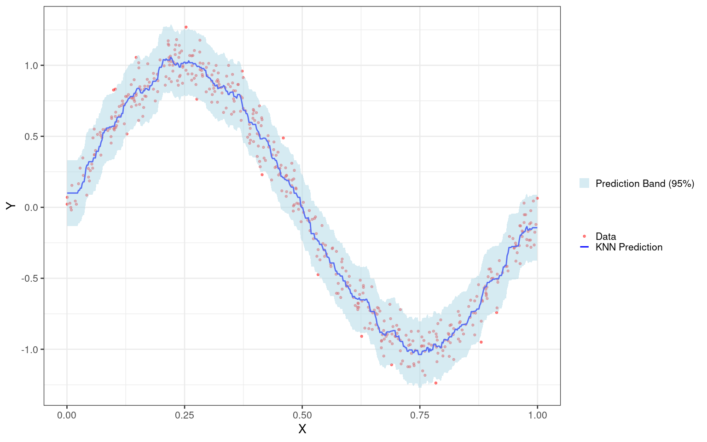

k-NN Regression with Conformal Prediction
================
Rafael Izbicki

## Load the necessary libraries

``` r
knitr::opts_chunk$set(echo = TRUE, warning = FALSE, message = FALSE, error = FALSE)

library(FNN)
library(ggplot2)
library(dplyr)
```

    ## 
    ## Attaching package: 'dplyr'

    ## The following objects are masked from 'package:stats':
    ## 
    ##     filter, lag

    ## The following objects are masked from 'package:base':
    ## 
    ##     intersect, setdiff, setequal, union

``` r
theme_set(theme_bw(base_size = 20)) 
```

## Generate Example Data

``` r
set.seed(123)
n <- 500
x <- runif(n)
y <- sin(2 * pi * x) + rnorm(n, sd = 0.1)
data <- data.frame(x = x, y = y)
```

## Split the Data into Training and Calibration Sets

``` r
train_indices <- sample(seq_len(n), size = 0.7 * n)
train_data <- data[train_indices, ]
calibration_data <- data[-train_indices, ]
```

## k-NN Regression

``` r
predictions <- FNN::knn.reg(
  train = as.matrix(train_data$x),
  test = as.matrix(calibration_data$x),
  y = train_data$y,
  k = 10
)
```

## Calibration of Conformal Score

``` r
t <- quantile(abs(predictions$pred - calibration_data$y), probs = 0.95)
```

## Generate a Fine Grid for the X-Axis

``` r
grid_data <- data.frame(x_grid = seq(min(data$x), max(data$x), length.out = 500))
```

## Evaluate Predictions on the Grid for Plotting

``` r
grid_data <- grid_data %>%
  mutate(y_pred = FNN::knn.reg(
    train = as.matrix(train_data$x),
    test = as.matrix(grid_data$x_grid),
    y = train_data$y,
    k = 10
  )$pred)
```

## Generate the Plot

``` r
ggplot(data, aes(x = x, y = y)) +
  geom_point(aes(color = "Data"), alpha = 0.5, size = 1.6) +
  geom_line(data = grid_data, aes(x = x_grid, y = y_pred, color = "KNN Prediction"), linewidth = 1) +
  geom_ribbon(data = grid_data, aes(x = x_grid, ymin = y_pred - t, ymax = y_pred + t, 
                                    fill = "Prediction Band (95%)"), alpha = 0.5) +
  theme(strip.background = element_blank(),  # Remove grey facet boxes
        strip.text = element_text(size = 22, face = "bold"),
        panel.spacing.x = unit(4, "lines")) +
  scale_color_manual(name = "", values = c("Data" = "red", "KNN Prediction" = "blue")) +
  scale_fill_manual(name = "", values = c("Prediction Band (95%)" = "lightblue")) +
  labs(x = "X", y = "Y")
```

<!-- -->

## Generate a Larger Dataset

``` r
n <- 100000
x <- runif(n)
y <- sin(2 * pi * x) + rnorm(n, sd = 0.1)
data <- data.frame(x = x, y = y)
```

## Test k-NN on the Larger Dataset

``` r
y_pred_test = FNN::knn.reg(
  train = as.matrix(train_data$x),
  test = as.matrix(data$x),
  y = train_data$y,
  k = 10
)$pred
mean(y_pred_test - t < y & y < y_pred_test + t)
```

    ## [1] 0.97008
