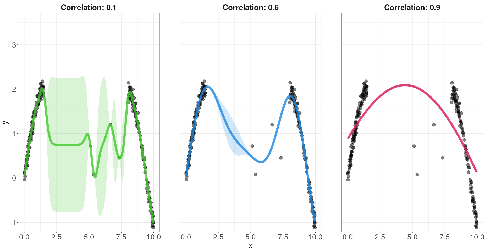

Gaussian Process Kernels
================
Rafael Izbicki

This notebook is part of the book “Machine Learning Beyond Point
Predictions: Uncertainty Quantification”, by Rafael Izbicki.

# Introduction

In this analysis, we explore how Gaussian Processes (GPs) with varying
bandwidth parameters (also known as length-scale or smoothness) affect
prediction sets. Specifically, we generate a dataset with two dense
regions and a sparse region in between. We then fit three different GPs
to this dataset, each with a different bandwidth parameter, and
visualize how the predictions and uncertainty bounds vary across these
models.

# Load necessary libraries

``` r
library(ggplot2)
library(dplyr)
library(MASS)
library(GauPro)
library(kernlab)
```

# Generate data

``` r
set.seed(2)

# Generate data: two dense regions of x and a sparse region between them
x_dense1 <- runif(100, min = 0, max = 1.5)
x_dense2 <- runif(100, min = 8, max = 10)
x_middle <- runif(4, min = 1.5, max = 7.5)
x_sparse <- c(x_dense1, x_dense2, x_middle)

# True function to generate y based on x
true_function <- function(x) {
  y <- 2 * sin(x) + rnorm(length(x), sd = 0.1)
  y[2 < x & x < 7.5] <- y[2 < x & x < 7.5] + rnorm(sum(2 < x & x < 7.5), sd = 2)
  return(y)
}

# Generate y based on the true function
y_dense <- true_function(x_sparse)

# Create a dataframe with the data
data <- data.frame(x = x_sparse, y = y_dense)
```

# Fit Gaussian Processes with varying bandwidths

``` r
# Prepare the data for GP fitting
X_mat <- matrix(data$x, ncol = 1)

# Fit three different GPs with varying bandwidths (theta)
gp1 <- gpkm(X_mat, data$y, normalize = TRUE, kernel = k_Gaussian(s2=0.1,D=1,s2_lower = 0.1,s2_upper = 0.1))   # GP with smaller bandwidth
gp2 <- gpkm(X_mat, data$y, normalize = TRUE, kernel = k_Gaussian(s2=1,D=1,s2_lower = 1,s2_upper = 1))   # GP with moderate bandwidth
gp3 <- gpkm(X_mat, data$y, normalize = TRUE, kernel = k_Gaussian(s2=10,D=1,s2_lower = 10,s2_upper = 10))     # GP with larger bandwidth
```

# Make predictions and plot the results

``` r
# Prepare a grid of x values for predictions
x_grid <- seq(min(x_sparse), max(x_sparse), length.out = 200)
X_new_mat <- matrix(x_grid, ncol = 1)

# Predictions for each model
pred1 <- predict(gp1, XX = X_new_mat, se.fit = TRUE)
pred2 <- predict(gp2, XX = X_new_mat, se.fit = TRUE)
pred3 <- predict(gp3, XX = X_new_mat, se.fit = TRUE)

# Combine the predictions into a single dataframe
predictions_combined <- data.frame(
  x_grid = rep(x_grid, 3),
  pred_mean = c(pred1$mean, pred2$mean, pred3$mean),
  lower_bound = c(pred1$mean - 1.96 * sqrt(pred1$s2), 
                  pred2$mean - 1.96 * sqrt(pred2$s2), 
                  pred3$mean - 1.96 * sqrt(pred3$s2)),
  upper_bound = c(pred1$mean + 1.96 * sqrt(pred1$s2), 
                  pred2$mean + 1.96 * sqrt(pred2$s2), 
                  pred3$mean + 1.96 * sqrt(pred3$s2)),
  model = factor(rep(c("Bandwidth: 0.1", "Bandwidth: 1", "Bandwidth: 10"), each = length(x_grid)))
)
```

# Plot the results

``` r
# Define the custom colors
custom_colors <- c("Bandwidth: 0.1" = "#44CA2E", 
                   "Bandwidth: 1" = "#1E88E5", 
                   "Bandwidth: 10" = "#D81B60")

# Plot with facets and updated facet labels showing bandwidth values
g <- ggplot() +
  geom_point(data = data, aes(x = x, y = y), alpha = 0.5, color = "black", size = 4) +
  geom_line(data = predictions_combined, aes(x = x_grid, y = pred_mean, color = model), size = 3, alpha = 0.8) +
  geom_ribbon(data = predictions_combined, aes(x = x_grid, ymin = lower_bound, ymax = upper_bound, fill = model), alpha = 0.2) +
  facet_wrap(~ model) +
  scale_color_manual(values = custom_colors) +
  scale_fill_manual(values = custom_colors) +
  theme_bw() +
  labs(x = "x", y = "y") +
  theme(text = element_text(size = 20),
        axis.text = element_text(size = 21),
        legend.key.width = unit(2, "cm"), legend.position = "none",
        strip.background = element_blank(),  
        strip.text = element_text(size = 22, face = "bold"),
        panel.spacing.x = unit(4, "lines")) +
  coord_cartesian(xlim = range(x_sparse), ylim = c(-1, 3.5))
g
```

<!-- -->
