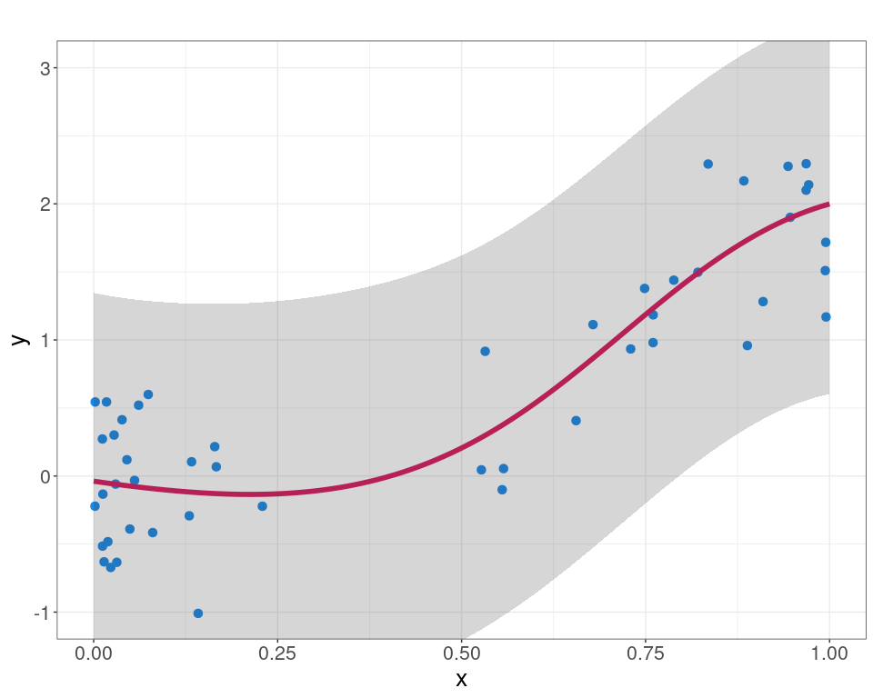
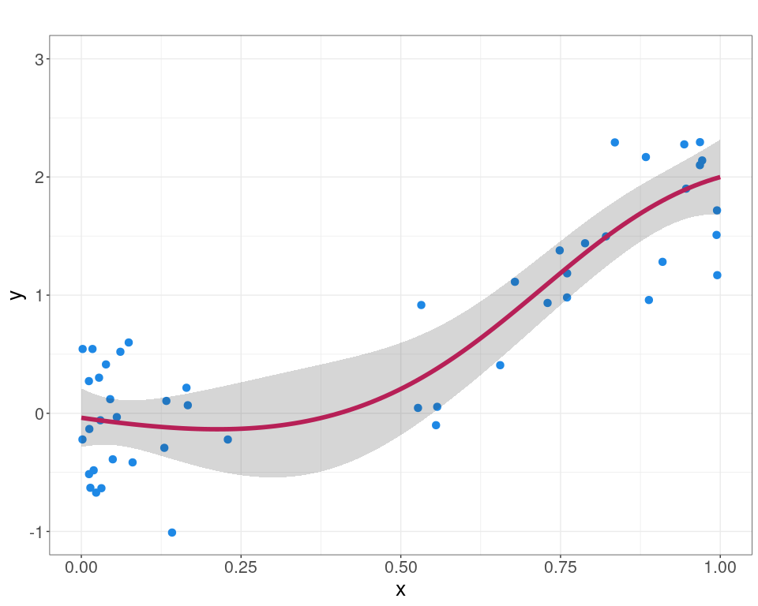

Gaussian Process
================
Rafael Izbicki

This notebook is part of the book “Machine Learning Beyond Point
Predictions: Uncertainty Quantification”, by Rafael Izbicki.

# Introduction

This notebook demonstrates how Gaussian processes (GP) can be used to
model data and quantify uncertainty. Using simulated data, it fits a GP
model and visualizes the results, highlighting both total and epistemic
uncertainty through credible/prediction intervals.

## Load Necessary Packages

``` r
library(ggplot2)
library(MASS)
library(GauPro)
```

## Set Simulation Parameters

``` r
n <- 50  # Number of data points
```

## Simulate Data

``` r
set.seed(2)  # For reproducibility
which <- (runif(n) > 0.5)
X <- which * rbeta(n, 5, 1) + (1 - which) * rbeta(n, 1, 10)
Y <- sapply(2 * X^2, function(x) rnorm(1, mean = x, sd = 0.5))  # Y ~ N(x, 0.1)
```

## Prepare Data for Gaussian Process Model

``` r
X_mat <- matrix(X, ncol = 1)
```

## Fit Gaussian Process Model

``` r
# Fit a Gaussian process using kergp
gp <- gpkm(X_mat, Y, normalize = TRUE)
```

## Predictions and Visualization

``` r
# New data for predictions
X_new <- seq(0, 1, length.out = 100)
X_new_mat <- matrix(X_new, ncol = 1)

# Obtain predictions from Gaussian Process model
predictions <- predict(gp, XX = X_new_mat, se.fit = TRUE)

# Extract means and standard deviations for prediction intervals
means <- predictions$mean
std_dev <- predictions$se
lower_bound <- means - 1.96 * std_dev
upper_bound <- means + 1.96 * std_dev
```

## Plot the Results for Total Uncertainty

``` r
ggplot() +
  geom_point(aes(x = X, y = Y), colour = "#1E88E5", size = 3) +  # Original data
  geom_line(aes(x = X_new, y = means), colour = "#D81B60", size = 2) +  # Estimated regression
  geom_ribbon(aes(x = X_new, ymin = lower_bound, ymax = upper_bound), 
              fill = "grey20", alpha = 0.2) +  # Prediction bands
  labs(title = "",
       x = "x", y = "y") +
  theme_bw() + 
  theme(text = element_text(size = 20), 
        legend.title = element_blank(), 
        legend.position = "top") +
  coord_cartesian(ylim = c(-1, 3)) 
```

<!-- -->

## Epistemic Uncertainty

``` r
# Alternative predictions with mean distance
predictions <- gp$pred(XX = X_new_mat, se = TRUE, mean_dist = TRUE)

# Extract means and standard deviations
means <- predictions$mean
std_dev <- predictions$se
lower_bound <- means - 1.96 * std_dev
upper_bound <- means + 1.96 * std_dev
```

``` r
ggplot() +
  geom_point(aes(x = X, y = Y), colour = "#1E88E5", size = 3) +  # Original data
  geom_line(aes(x = X_new, y = means), colour = "#D81B60", size = 2) +  # Estimated regression
  geom_ribbon(aes(x = X_new, ymin = lower_bound, ymax = upper_bound), 
              fill = "grey20", alpha = 0.2) +  # Prediction bands
  labs(title = "",
       x = "x", y = "y") +
  theme_bw() + 
  theme(text = element_text(size = 20), 
        legend.title = element_blank(), 
        legend.position = "top") +
  coord_cartesian(ylim = c(-1, 3))
```

<!-- -->
