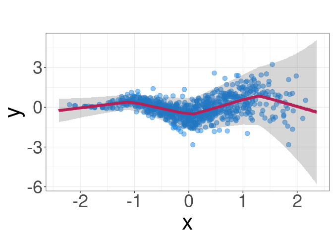
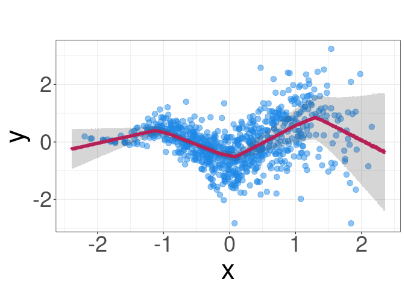

Monte Carlo Dropout
================
Rafael Izbicki
2024-10-18

This notebook is part of the book “Machine Learning Beyond Point
Predictions: Uncertainty Quantification”, by Rafael Izbicki.

# Introduction

In this document, we explore the implementation of Monte Carlo (MC)
Dropout for Gaussian process simulations using the `torch` package in R.
The goal is to predict outputs and quantify uncertainty by estimating
both aleatoric and epistemic uncertainties. The model uses a neural
network with dropout applied during training and prediction. We will
generate synthetic data, train a neural network, and then evaluate the
predictions and uncertainties using MC Dropout.

# Required Libraries

``` r
library(torch)
library(ggplot2)
library(dplyr)
library(MASS)
```

# Data Generation

We first define the Gaussian log-likelihood loss function and generate
synthetic data using an RBF kernel. The data is split into training and
validation sets for model evaluation.

``` r
# Define Gaussian log-likelihood loss function
gaussian_log_likelihood <- function(predictions, y_true) {
  mean_pred <- predictions[[1]]  # Mean prediction
  log_var_pred <- predictions[[2]]  # Predicted log variance
  
  # Variance is exp(log variance)
  var_pred <- torch_exp(log_var_pred)
  
  # Calculate Gaussian log-likelihood loss
  loss <- 0.5 * torch_mean(torch_div(torch_square(y_true - mean_pred), var_pred) + log_var_pred)
  return(loss)
}

# Set seed for reproducibility
set.seed(2)

# Parameters for data generation
no_points <- 800
lengthscale <- 0.5
variance <- 1.0
sig_noise <- 0.3

# Generate input data (x) and scale from [0,1] to [-3,3]
x_raw <- rbeta(no_points, shape1 = 7, shape2 = 7)
x <- x_raw * 6 - 3

# RBF kernel function for covariance calculation
rbf_kernel <- function(x1, x2, variance, lengthscale) {
  sqdist <- outer(x1, x2, FUN = function(a, b) (a - b)^2)  # Squared distance
  K <- variance * exp(-0.5 * sqdist / lengthscale^2)  # Covariance matrix
  return(K)
}

# Compute covariance matrix with noise
K <- rbf_kernel(x, x, variance, lengthscale)
noise_variance <- (x + 2)^2 * sig_noise^2
C <- K + diag(noise_variance)

# Generate target values (y) ~ N(0, C)
y <- mvrnorm(n = 1, mu = rep(0, no_points), Sigma = C)
y <- y - mean(y)  # Center y by subtracting its mean

# Convert x and y to matrices for torch compatibility
x <- as.matrix(x)
y <- as.matrix(y)

# Normalize input data (x)
x_mean <- mean(x)
x_sd <- sd(x)
x_normalized <- (x - x_mean) / x_sd

# Create dataframe for data handling
data <- data.frame(x = x_normalized, y = y)
```

# Data Splitting

We split the dataset into training (80%) and validation (20%) sets.

``` r
# Split data into training (80%) and validation (20%) sets
set.seed(123)
train_indices <- sample(seq_len(nrow(data)), size = 0.8 * nrow(data))
train_data <- data[train_indices, ]
valid_data <- data[-train_indices, ]
```

# Neural Network Model with Monte Carlo Dropout

We define a neural network with MC Dropout and train it on the generated
data.

``` r
# Define neural network model with Monte Carlo Dropout
net <- nn_module(
  "MC_Dropout_Model",
  initialize = function(input_dim, num_units, output_dim, drop_prob = 0.5) {
    self$layer1 <- nn_linear(input_dim, num_units)
    self$dropout1 <- nn_dropout(p = drop_prob)
    
    # Separate layers for predicting mean and log(variance)
    self$fc_mean <- nn_linear(num_units, output_dim)
    self$fc_log_var <- nn_linear(num_units, output_dim)
  },
  
  forward = function(x) {
    x <- x$view(c(-1, self$layer1$in_features))  # Reshape input if necessary
    x <- torch_relu(self$layer1(x))
    x <- self$dropout1(x)  # Apply dropout for MC Dropout
    
    # Predict mean and log(variance)
    mean_pred <- self$fc_mean(x)
    log_var_pred <- self$fc_log_var(x)
    
    return(list(mean_pred = mean_pred, log_var_pred = log_var_pred))
  }
)

# Define prediction grid and normalize it
x_grid <- torch_linspace(min(x)-0.2, max(x)+0.2, steps = 1000)$view(c(-1, 1))
x_grid_normalized <- (x_grid - x_mean) / x_sd
```

# Model Training

The model is trained over 1500 epochs, and the training and validation
losses are printed every 100 epochs.

``` r
# Initialize neural network model with parameters
input_size <- 1
hidden_size <- 200
output_size <- 1
p_dropout <- 0.5

model <- net(input_size, hidden_size, output_size, p_dropout)

# Define optimizer
optimizer <- optim_adam(model$parameters, lr = 0.001)

# Prepare training data as torch tensors
x_train <- torch_tensor(matrix(train_data$x, ncol = 1))
y_train <- torch_tensor(matrix(train_data$y, ncol = 1))

# Prepare validation data as torch tensors
x_valid <- torch_tensor(matrix(valid_data$x, ncol = 1))
y_valid <- torch_tensor(matrix(valid_data$y, ncol = 1))

# Train the model over a fixed number of epochs
epochs <- 1500
for (epoch in 1:epochs) {
  model$train()  # Switch to training mode
  optimizer$zero_grad()  # Reset gradients
  
  # Forward pass: predict outputs
  predictions <- model(x_train)
  
  # Compute Gaussian log-likelihood loss
  loss <- gaussian_log_likelihood(predictions, y_train)
  
  # Backpropagation and optimization
  loss$backward()
  optimizer$step()
  
  # Calculate validation loss every 100 epochs
  if (epoch %% 100 == 0) {
    model$eval()  # Switch to evaluation mode
    valid_predictions <- model(x_valid)
    valid_loss <- gaussian_log_likelihood(valid_predictions, y_valid)
    cat(sprintf("Epoch [%d/%d], Training Loss: %.4f, Validation Loss: %.4f\n",
                epoch, epochs, loss$item(), valid_loss$item()))
  }
}
```

    ## Epoch [100/1500], Training Loss: 0.0015, Validation Loss: 0.0733
    ## Epoch [200/1500], Training Loss: -0.0248, Validation Loss: 0.0444
    ## Epoch [300/1500], Training Loss: -0.0252, Validation Loss: 0.0320
    ## Epoch [400/1500], Training Loss: -0.0443, Validation Loss: 0.0248
    ## Epoch [500/1500], Training Loss: -0.0347, Validation Loss: 0.0255
    ## Epoch [600/1500], Training Loss: -0.0618, Validation Loss: 0.0192
    ## Epoch [700/1500], Training Loss: -0.0511, Validation Loss: 0.0210
    ## Epoch [800/1500], Training Loss: -0.0494, Validation Loss: 0.0208
    ## Epoch [900/1500], Training Loss: -0.0484, Validation Loss: 0.0184
    ## Epoch [1000/1500], Training Loss: -0.0594, Validation Loss: 0.0167
    ## Epoch [1100/1500], Training Loss: -0.0576, Validation Loss: 0.0165
    ## Epoch [1200/1500], Training Loss: -0.0606, Validation Loss: 0.0140
    ## Epoch [1300/1500], Training Loss: -0.0465, Validation Loss: 0.0149
    ## Epoch [1400/1500], Training Loss: -0.0629, Validation Loss: 0.0168
    ## Epoch [1500/1500], Training Loss: -0.0481, Validation Loss: 0.0156

# Predictions and Uncertainty Estimation

After training, we use Monte Carlo Dropout to estimate the epistemic and
aleatoric uncertainties.

``` r
# Monte Carlo Dropout prediction function
monte_carlo_dropout_predict <- function(model, x_data, n_samples = 100) {
  model$train()  # Keep dropout active during prediction
  mean_samples <- list()
  std_samples <- list()
  
  for (i in 1:n_samples) {
    output <- model(x_data)
    mean_pred <- output$mean_pred
    log_var_pred <- output$log_var_pred
    
    # Convert log variance to standard deviation
    std_pred <- torch_exp(0.5 * log_var_pred)
    
    # Store mean and standard deviation predictions
    mean_samples[[i]] <- mean_pred
    std_samples[[i]] <- std_pred
  }
  
  # Stack samples into tensors
  mean_samples <- torch_stack(mean_samples)
  std_samples <- torch_stack(std_samples)
  
  # Compute epistemic and aleatoric uncertainties
  epistemic_var_pred <- torch_var(mean_samples, dim = 1)
  aleatoric_var_pred <- torch_mean(std_samples^2, dim = 1)
  total_var_pred <- epistemic_var_pred + aleatoric_var_pred
  mean <- torch_mean(mean_samples, dim = 1)
  
  return(list(epistemic_var_pred = epistemic_var_pred, aleatoric_var_pred = aleatoric_var_pred, 
              total_var_pred = total_var_pred, mean = mean))
}

# Generate predictions using Monte Carlo Dropout
results_loglik <- monte_carlo_dropout_predict(model, x_grid_normalized, 5000)
```

# Visualizing Predictions

We visualize the model’s predictions along with the uncertainty bands.

``` r
# Extract values and denormalize
x_grid_array <- as_array(x_grid_normalized) * x_sd + x_mean
pred_mean <- as_array(results_loglik$mean)
lower_bound <- pred_mean - 2 * as_array(torch_sqrt(results_loglik$total_var_pred))
upper_bound <- pred_mean + 2 * as_array(torch_sqrt(results_loglik$total_var_pred))
lower_bound_eps <- pred_mean - 2 * as_array(torch_sqrt(results_loglik$epistemic_var_pred))
upper_bound_eps <- pred_mean + 2 * as_array(torch_sqrt(results_loglik$epistemic_var_pred))

# Create dataframe for plotting predictions and uncertainties
df_grid_pred_loglik <- data.frame(
  x_grid = x_grid_array,
  pred_mean_loglik = pred_mean,
  lower_bound_loglik = lower_bound,
  upper_bound_loglik = upper_bound,
  lower_bound_loglik_eps = lower_bound_eps,
  upper_bound_loglik_eps = upper_bound_eps
)

# Create training and validation dataframes for plotting
train_data <- data.frame(
  x = as_array(x_train) * x_sd + x_mean,  # Denormalize x
  y = as_array(y_train)
)

valid_data <- data.frame(
  x = as_array(x_valid) * x_sd + x_mean,  # Denormalize x
  y = as_array(y_valid)
)

# Combine training and validation data
combined_data <- rbind(train_data, valid_data)

# Plot predictions with total uncertainty bands
g_loglik <- ggplot(df_grid_pred_loglik) +
  geom_point(data = combined_data, aes(x = x, y = y), 
             colour = "#1E88E5", size = 3,alpha=0.5) +  # Observed data
  geom_line(aes(x = x_grid, y = pred_mean_loglik), colour = "#D81B60", size = 2) +  # Predicted mean
  geom_ribbon(aes(x = x_grid, ymin = lower_bound_loglik, ymax = upper_bound_loglik), 
              fill = "grey20", alpha = 0.2) +  # Total uncertainty bands
  labs(title = "", x = "x", y = "y") +
  theme_bw() + 
  theme(text = element_text(size = 34), 
        legend.title = element_blank(), 
        legend.position = "top")
g_loglik
```

<!-- -->

``` r
# Plot predictions with epistemic uncertainty bands
g_loglik2 <- ggplot(df_grid_pred_loglik) +
  geom_point(data = combined_data, aes(x = x, y = y), 
             colour = "#1E88E5", size = 3,alpha=0.5) +  # Observed data
  geom_line(aes(x = x_grid, y = pred_mean_loglik), colour = "#D81B60", size = 2) +  # Predicted mean
  geom_ribbon(aes(x = x_grid, ymin = lower_bound_loglik_eps, ymax = upper_bound_loglik_eps), 
              fill = "grey20", alpha = 0.2) +  # Epistemic uncertainty bands
  labs(title = "", x = "x", y = "y") +
  theme_bw() + 
  theme(text = element_text(size = 34), 
        legend.title = element_blank(), 
        legend.position = "top")
g_loglik2
```

<!-- -->
