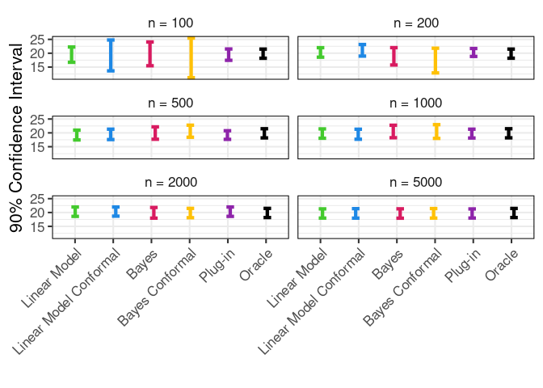
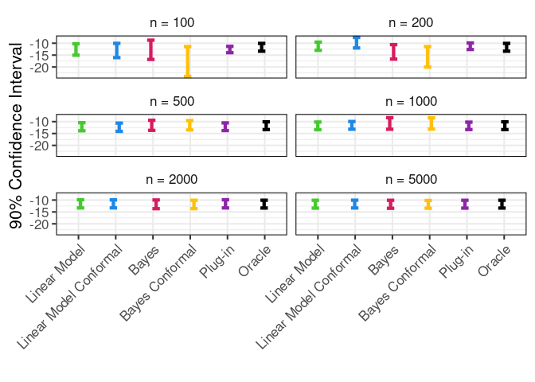

Comparing Prediction Sets
================
Rafael Izbicki

## Introduction

This study compares predictive methods—Bayesian regression, conformal
prediction, and classical linear models—by evaluating their ability to
generate reliable prediction intervals using simulated data.

The methods include:

- **Bayesian Regression**: Produces intervals using posterior
  distributions.
- **Conformal Prediction**: Ensures prediction intervals with a given
  confidence level.
- **Linear Models**: Traditional frequentist approach.

We assess performance as sample sizes change.

## Load libraries

``` r
library(tidyverse)
library(glmnet)
library(mvtnorm)
library(extraDistr)
library(rsample)
```

## Data Generation

We use the `generate_hom_gaussian()` function to create synthetic data
from a homoscedastic Gaussian distribution, simulating noisy but
well-behaved real-world situations.

``` r
generate_hom_gaussian <- function(n, d, x = NULL) {
  if (is.null(x)) {
    x = matrix(runif(n * d, -5, 5), n, d)
  }
  mean_g <- 5 * x[, 1]
  y = mean_g + rnorm(nrow(x), 0, 1)
  return(list(x = x, y = y, mean = mean_g))
}
```

## Regularization Path

We calculate the **lambda path** for fitting linear models with
`glmnet`, controlling overfitting with regularization.

``` r
lambda_path <- function(x, y) {
  sx <- scale(x, scale = apply(x, 2, sd))
  lambda_max <- max(abs(colSums(sx * y))) / length(y)
  lambdapath <- exp(seq(log(lambda_max), log(lambda_max * 0.0001), length.out = 100))
  return(lambdapath)
}
```

## Bayesian Regression

The `fit_bayes()` function fits a Bayesian regression model, offering
point predictions and prediction intervals.

``` r
fit_bayes <- function(xTrain,yTrain,a,b,gamma_0)
{
  mu_0 <- rep(0,ncol(xTrain))
  reescale_factor <- mean(yTrain)
  yTrain <- yTrain-reescale_factor
  Gamma_0 <- diag(gamma_0,ncol(xTrain))
  a_star <- a+nrow(xTrain)/2
  Gamma_star <- t(xTrain)%*%xTrain+Gamma_0
  mu_star <- solve(Gamma_star)%*%(Gamma_0%*%mu_0+t(xTrain)%*%yTrain)
  b_star <- b+(t(yTrain)%*%yTrain + t(mu_0)%*% Gamma_0%*%mu_0- t(mu_star)%*%Gamma_star%*%mu_star )/2
  output <- list(a_star=a_star,
                 Gamma_star=Gamma_star,
                 mu_star=mu_star,
                 b_star=b_star,
                 reescale_factor=reescale_factor)
  class(output) <- "fitbayes"
  return(output)
}
```

## Cross-Validation to choose hyperparameters

We fine-tune the hyperparameter of the Bayesian model using
cross-validation to minimize mean squared error (MSE).

``` r
bayesian_regression_cv <- function(xTrain,yTrain,
                                   a_0=0.00001,
                                   b_0=1,nFolders=10,gamma_0_grid=seq(0.001,100,length.out=100))
{
  mse <- rep(NA,length(gamma_0_grid))
  cv <- vfold_cv(xTrain, v = nFolders)
  predictions <- rep(NA,length(yTrain))
  for(gg in 1:length(mse))
  {
    for(folder in 1:nFolders)
    {
      fit <- fit_bayes(xTrain[cv$splits[[folder]]$in_id,],yTrain[cv$splits[[folder]]$in_id],
                       a_0,b_0,gamma_0_grid[gg])
      predictions[-cv$splits[[folder]]$in_id] <- predict(fit,xTrain[-cv$splits[[folder]]$in_id,])$pred
    }
    mse[gg] <- mean((predictions-yTrain)^2)  
  }
  gamma_0 <- gamma_0_grid[which.min(mse)[1]]
  fit <- fit_bayes(xTrain,yTrain,a_0,b_0,gamma_0)
  
  output <- list(a_star=fit$a_star,
                 Gamma_star=fit$Gamma_star,
                 mu_star=fit$mu_star,
                 b_star=fit$b_star,
                 reescale_factor=fit$reescale_factor,
                 a_0=a_0,
                 b_0=b_0,
                 gamma_0=gamma_0,
                 mse=mse)
  class(output) <- "fitbayes"
  return(output)
}
```

## Prediction for Bayesian Model

Next, we need a `predict_bayes()` function to generate predictions and
intervals from the Bayesian model:

``` r
predict.fitbayes <- function(fit,xNew,alpha=0.1)
{
  pred=fit$reescale_factor+xNew%*%fit$mu_star
  cov=as.numeric(fit$b_star/fit$a_star)*
    (diag(1,nrow(xNew))+xNew%*%solve(fit$Gamma_star)%*%t(xNew))
  lower <- qlst(alpha/2, df=2*fit$a_star, 
                mu = as.numeric(pred), 
                sigma = sqrt(diag(cov)))
  upper <- qlst(1-alpha/2, df=2*fit$a_star, 
                mu = as.numeric(pred), 
                sigma = sqrt(diag(cov)))
  return(list(pred=pred,
              cov=cov,
              lower=lower,
              upper=upper)
  )
}
```

## Conformal Prediction

For conformal prediction, we use the regression-split method that takes
the residuals on a validation set and constructs prediction intervals.

``` r
conformal <- function(fit,xCal,yCal,alpha=0.1)
{
  predictions <- predict(fit,xCal)
  if("pred"%in%names(predictions))
  {
    predictions=predictions$pred 
  }
  residuals <- abs(predictions-yCal)
  output <- list(cutoff=quantile(residuals,probs = 1-alpha),fit=fit)
  class(output) <- "conformal"
  return(output)
}

predict.conformal <- function(fit,xNew)
{
  pred <- predict(fit$fit,xNew)
  if("pred"%in%names(pred))
  {
    pred=pred$pred 
  }
  lower <- pred-fit$cutoff
  upper <- pred+fit$cutoff
  return(list(pred=pred,
              lower=lower,
              upper=upper)
  )
}
```

## Simulation

We compare prediction intervals generated by Bayesian, conformal, and
linear models for sample sizes ranging from 100 to 5000.

``` r
run_simulation <- function(seed) {
  set.seed(seed)  # Set the seed
  
  d <- 65
  l <- 10  # prior hyperparameter
  alpha <- 0.1  # 1-alpha is the nominal coverage of the prediction sets
  simulator <- generate_hom_gaussian
  
  n_test <- 1
  data_test <- simulator(n_test, d)
  pred_oracle <- data.frame(pred = data_test$mean,
                            lower = qnorm(alpha / 2, data_test$mean, , data_test$sd),
                            upper = qnorm(1 - alpha / 2, data_test$mean, , data_test$sd))
  
  n_values <- c(100, 200, 500, 1000, 2000, 5000)
  combined_df_all <- tibble()
  
  for (n in n_values) {
    print(n)
    
    data_train_and_val <- simulator(n, d)
    ids <- sample(c("train", "val"), size = n, prob = c(0.7, 0.3), replace = TRUE)
    xTrain <- data_train_and_val$x[ids == "train", ]
    yTrain <- data_train_and_val$y[ids == "train", drop = FALSE]
    xVal <- data_train_and_val$x[ids == "val", ]
    yVal <- data_train_and_val$y[ids == "val", drop = FALSE]
    
    # LM Conformal
    fitted_lm <- glmnet(x = xTrain, y = yTrain, alpha = 0, lambda = 0)
    fitted_lm_conformal <- conformal(fitted_lm, xVal, yVal, alpha = alpha)
    pred_lm_conformal <- predict(fitted_lm_conformal, data_test$x)
    
    # LM Exact predictive
    data <- data.frame(y = data_train_and_val$y, x = data_train_and_val$x)
    fitted_lm_exact <- lm(y ~ ., data = data)
    data_full_test <- data.frame(y = data_test$y, x = data_test$x)
    pred_lm_exact <- predict(fitted_lm_exact, data_full_test, interval = "prediction", level = 1 - alpha) %>%
      as.data.frame()
    colnames(pred_lm_exact) <- c("pred", "lower", "upper")
    
    # Bayes
    gamma_0_grid <- l
    fitted_bayes <- bayesian_regression_cv(data_train_and_val$x, data_train_and_val$y, 
                                           gamma_0_grid = gamma_0_grid)
    pred_bayes <- predict(fitted_bayes, data_test$x, alpha = alpha)
    
    fitted_bayes_conformal <- bayesian_regression_cv(xTrain, yTrain, gamma_0_grid = gamma_0_grid)
    fitted_bayes_conformal <- conformal(fitted_bayes_conformal, xVal, yVal, alpha = alpha)
    pred_bayes_conformal <- predict(fitted_bayes_conformal, data_test$x)
    
    pred_bayes <- data.frame(
      pred = pred_bayes$pred,
      lower = pred_bayes$lower,
      upper = pred_bayes$upper
    )
    pred_bayes_conformal <- data.frame(
      pred = pred_bayes_conformal$pred,
      lower = pred_bayes_conformal$lower,
      upper = pred_bayes_conformal$upper
    )
    
    pred_lm_conformal <- data.frame(
      pred = c(pred_lm_conformal$pred),
      lower = c(pred_lm_conformal$lower),
      upper = c(pred_lm_conformal$upper)
    )
    
    pred_plugin <- data.frame(pred = c(pred_lm_exact$pred),
                              lower = qnorm(alpha / 2, pred_lm_exact$pred, sigma(fitted_lm)),
                              upper = qnorm(1 - alpha / 2, pred_lm_exact$pred, sigma(fitted_lm)))
    
    combined_df <- rbind(
      data.frame(method = "pred_lm_exact", n = n, pred_lm_exact),
      data.frame(method = "pred_bayes_exact", n = n, pred_bayes),
      data.frame(method = "pred_lm_conformal_exact", n = n, pred_lm_conformal),
      data.frame(method = "pred_bayes_conformal_exact", n = n, pred_bayes_conformal),
      data.frame(method = "pred_plugin", n = n, pred_plugin),
      data.frame(method = "pred_oracle", n = n, pred_oracle)
    )
    
    combined_df_all <- bind_rows(combined_df_all, combined_df)
  }
  
  combined_df_all$method <- factor(combined_df_all$method,
                                   levels = c("pred_lm_exact",
                                              "pred_lm_conformal_exact",
                                              "pred_bayes_exact",
                                              "pred_bayes_conformal_exact",
                                              "pred_plugin",
                                              "pred_oracle"))
  
  custom_colors <- c("#44CA2E", "#1E88E5", "#D81B60", "#FFC107", "#8E24AA", "#000000")
  
  # Plot
  g <- ggplot(combined_df_all, aes(x = method, color = method, y = pred)) +
    geom_errorbar(aes(ymin = lower, ymax = upper), width = 0.2, linewidth = 1.5,
                  position = position_jitter(width = 0.1)) +
    facet_wrap(~ n, ncol = 2, labeller = labeller(n = function(x) paste0("n = ", x))) +
    labs(x = '', y = '90% Confidence Interval') +
    theme_bw(base_size = 16) +  # Use theme_bw for a clean, grid-based look
    theme(legend.position = "none",  # Remove redundant legend
          axis.text.x = element_text(angle = 45, hjust = 1),
          strip.background = element_blank(),  # Remove grey facet boxes
          panel.border = element_rect(color = "black")) +  # Keep black panel border
    scale_x_discrete(labels = c("pred_bayes_conformal_exact" = "Bayes Conformal",
                                "pred_bayes_exact" = "Bayes",
                                "pred_lm_conformal_exact" = "Linear Model Conformal",
                                "pred_lm_exact" = "Linear Model",
                                "pred_plugin" = "Plug-in",
                                "pred_oracle" = "Oracle")) +  # Rename method labels
    scale_color_manual(values = custom_colors)  # Apply custom colors
  
  print(g)
}

# Run simulations
run_simulation(0)
```

    ## [1] 100
    ## [1] 200
    ## [1] 500
    ## [1] 1000
    ## [1] 2000
    ## [1] 5000

<!-- -->

``` r
run_simulation(1)
```

    ## [1] 100
    ## [1] 200
    ## [1] 500
    ## [1] 1000
    ## [1] 2000
    ## [1] 5000

<!-- -->
