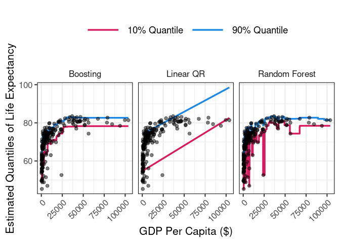

Quantile Regression
================
Rafael Izbicki

This notebook is part of the book “Machine Learning Beyond Point
Predictions: Uncertainty Quantification”, by Rafael Izbicki.

## Introduction

In this analysis, we explore the relationship between Life Expectancy
and GDP per capita using quantile regression to estimate the 10th and
90th quantiles.

We use the World Development Indicators dataset and compare the results
across three quantile regressions models through visualizations of
estimated quantiles.

## Data Import and Model Fitting

``` r
# Load the dataset
dados <- read_csv("../data/worldDevelopmentIndicators.csv")

# Fit quantile regression models
reg_quant <- rq(LifeExpectancy ~ GDPercapita, tau = 0.1, data = dados)
reg_quant2 <- rq(LifeExpectancy ~ GDPercapita, tau = 0.9, data = dados)

# Fit random forest model
rf <- ranger(LifeExpectancy ~ GDPercapita, quantreg = TRUE, data = dados)

# Fit boosting models for 10th and 90th percentiles
bst <- gbm(LifeExpectancy ~ GDPercapita, distribution = list(name = "quantile", alpha = 0.1), data = dados)
bst2 <- gbm(LifeExpectancy ~ GDPercapita, distribution = list(name = "quantile", alpha = 0.9), data = dados)
```

## Predictions

``` r
# Create a grid of GDP per capita values
df <- crossing(GDPercapita = seq(min(dados$GDPercapita), max(dados$GDPercapita), 10))

# Combine predictions from different models
df <- df %>%
  mutate(modelo = "Linear QR", quantile = "0.1") %>%
  bind_cols(previsao = predict(reg_quant, df)) %>%
  bind_rows(df %>%
              mutate(modelo = "Random Forest", quantile = "0.1") %>%
              bind_cols(previsao = predict(rf, df, type = "quantiles", quantiles = 0.1)$predictions[,1])) %>%
  bind_rows(df %>%
              mutate(modelo = "Boosting", quantile = "0.1") %>%
              bind_cols(previsao = predict(bst, df))) %>%
  bind_rows(df %>%
              mutate(modelo = "Random Forest", quantile = "0.9") %>%
              bind_cols(previsao = predict(rf, df, type = "quantiles", quantiles = 0.9)$predictions[,1])) %>%
  bind_rows(df %>%
              mutate(modelo = "Boosting", quantile = "0.9") %>%
              bind_cols(previsao = predict(bst2, df))) %>%
  bind_rows(df %>%
              mutate(modelo = "Linear QR", quantile = "0.9") %>%
              bind_cols(previsao = predict(reg_quant2, df)))
```

## Visualization

``` r
ggplot() +
  geom_line(data = df %>% filter(quantile == "0.1"),
            aes(GDPercapita, previsao, color = "10% Quantile"), size = 1.2) +
  geom_line(data = df %>% filter(quantile == "0.9"),
            aes(GDPercapita, previsao, color = "90% Quantile"), size = 1.2) +
  geom_point(data = dados, aes(x = GDPercapita, y = LifeExpectancy), size = 2, alpha = .5) +
  scale_color_manual(values = c("10% Quantile" = "#D81B60", "90% Quantile" = "#1E88E5")) +
  labs(y = "Estimated Quantiles of Life Expectancy",
       color = NULL,  # Remove the legend title
       x = "GDP Per Capita ($)") +
  facet_grid(~ modelo) +
  theme_bw(base_size = 16) +  # Use theme_bw for a clean, grid-based look
  theme(legend.position = "top",  # Place legend at the top
        legend.text = element_text(size = 14),  # Increase legend text size
        legend.key.size = unit(2, "cm"),  # Increase the size of legend keys
        axis.text.x = element_text(angle = 45, hjust = 1),
        strip.background = element_blank(),  # Remove grey facet boxes
        panel.border = element_rect(color = "black")) +  # Keep black panel border
  guides(color = guide_legend(override.aes = list(size = 3)))  # Increase line width in the legend
```

<!-- -->
