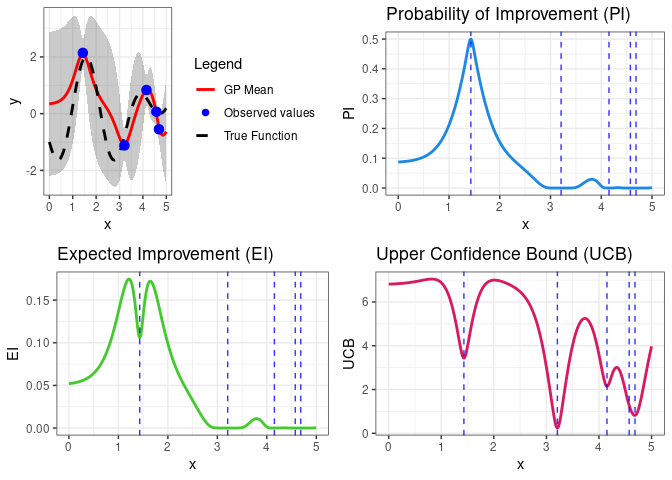

Bayesian Optimization
================
Rafael Izbicki

This notebook is part of the book “Machine Learning Beyond Point
Predictions: Uncertainty Quantification”, by Rafael Izbicki.

# Introduction

In this document, we will explore how to use Gaussian Processes (GPs)
for modeling a noisy objective function. We’ll fit a GP model using the
`GauPro` package in R and utilize different acquisition functions for
Bayesian optimization, including Expected Improvement (EI), Probability
of Improvement (PI), and Upper Confidence Bound (UCB). Each step will be
accompanied by explanations to help understand why it’s necessary.

# Required Libraries

We will start by loading the necessary libraries. `GauPro` is used for
fitting Gaussian Process models, while `ggplot2` and `gridExtra` are
utilized for plotting and arranging plots.

``` r
library(GauPro)
library(ggplot2)
library(gridExtra)
```

# Defining the Objective Function

Our objective function is a noisy sine-cosine wave. The function takes
an input `x` and adds Gaussian noise. This simulates the type of noisy,
real-world functions typically encountered in optimization problems.

``` r
objective <- function(x, noise = 0.5) {
  -sin(3 * x) - cos(2 * x) + noise * rnorm(length(x))
}
```

We also define the true objective function without noise to compare
later.

``` r
true_objective <- function(x) {
  -sin(3 * x) - cos(2 * x)
}
```

# Sampling the Objective Function

We define the bounds of the input space and generate some initial random
samples to evaluate the noisy objective function. These initial samples
will be used to fit our Gaussian Process model.

``` r
bounds <- c(0.0, 5.0)
set.seed(42)
x_initial <- runif(5, 0.0, 5.0)
y_initial <- objective(x_initial)
```

# Fitting the Gaussian Process Model

Next, we fit a Gaussian Process model using the `GauPro` package.
Gaussian Processes are commonly used in Bayesian optimization due to
their flexibility in modeling non-linear functions.

``` r
x_initial_mat <- matrix(x_initial, ncol = 1)
gp_model <- GauPro_kernel_model$new(X = x_initial_mat, 
                                    Z = y_initial, normalize = TRUE)
```

# Making Predictions

We create a sequence of evenly spaced points over the input space and
use the fitted GP model to predict the function’s values at these new
points. This gives us both the mean predictions and the uncertainty
(standard deviation) associated with the predictions.

``` r
x_new <- seq(0, 5, length.out = 1000)
x_new_mat <- matrix(x_new, ncol = 1)

pred <- gp_model$pred(XX = x_new_mat, se = TRUE)
means <- pred$mean
std_dev <- sqrt(pred$s2)
```

# Defining Prediction Intervals

Using the GP predictions, we can calculate 95% confidence intervals by
adding and subtracting 1.96 times the standard deviation from the mean.
This interval represents our uncertainty about the function’s value at
each point.

``` r
lower_bound <- means - 1.96 * std_dev
upper_bound <- means + 1.96 * std_dev
```

# Acquisition Functions

In Bayesian optimization, acquisition functions guide the search for the
optimum by balancing exploration (looking at uncertain regions) and
exploitation (looking at promising regions). We calculate three
acquisition functions:

- **Probability of Improvement (PI)**: The probability that the new
  point will improve upon the current best result.
- **Expected Improvement (EI)**: The expected improvement in function
  value, accounting for both the likelihood and magnitude of
  improvement.
- **Upper Confidence Bound (UCB)**: Encourages exploration by adding a
  multiple of the standard deviation to the mean prediction.

``` r
h_prime <- max(means)
z <- (means - h_prime) / std_dev
z[std_dev == 0] <- 0

pi <- pnorm(z)
ei <- (means - h_prime) * pnorm(z) + std_dev * dnorm(z)
ucb <- means + 5.0 * std_dev
```

# Visualizing the Results

Now, we create plots to visualize the GP predictions along with the
acquisition functions.

1.  The first plot shows the GP’s predicted mean, 95% confidence
    intervals, the true noiseless function, and the initial observed
    points.
2.  The second plot visualizes the Probability of Improvement (PI).
3.  The third plot shows the Expected Improvement (EI).
4.  The final plot displays the Upper Confidence Bound (UCB).

``` r
# Data for plotting
plot_data <- data.frame(
  x = x_new,
  mu = means,
  lower = lower_bound,
  upper = upper_bound,
  true = true_objective(x_new),
  pi = pi,
  ei = ei,
  ucb = ucb
)

obs_data <- data.frame(x = x_initial, y = y_initial)

# GP Prediction Plot
p1 <- ggplot(plot_data, aes(x = x)) +
  geom_ribbon(aes(ymin = lower, ymax = upper), fill = "gray30", alpha = 0.3) +
  geom_line(aes(y = mu, color = "GP Mean"), size = 1) +
  geom_line(aes(y = true, color = "True Function"), linetype = "dashed", size = 1) +
  geom_point(data = obs_data, aes(x = x, y = y, color = "Observed values  "), size = 3) +
  ylab("y") +
  scale_color_manual(
    name = "Legend",
    values = c("GP Mean" = "red", "True Function" = "black", "Observed values  " = "blue"),
    guide = guide_legend(override.aes = list(size = 2))
  ) +
  theme_bw() 

# Probability of Improvement (PI) Plot
p2 <- ggplot(plot_data, aes(x = x, y = pi)) +
  geom_line(color = "#1E88E5", size = 1) +
  geom_vline(xintercept = x_initial, color = "blue", linetype = "dashed", size = 0.5, alpha = 0.8) +
  ggtitle("Probability of Improvement (PI)") +
  theme_bw() +
  ylab("PI")

# Expected Improvement (EI) Plot
p3 <- ggplot(plot_data, aes(x = x, y = ei)) +
  geom_line(color = "#44CA2E", size = 1) +
  geom_vline(xintercept = x_initial, color = "blue", linetype = "dashed", size = 0.5, alpha = 0.8) +
  ggtitle("Expected Improvement (EI)") +
  theme_bw() +
  ylab("EI")

# Upper Confidence Bound (UCB) Plot
p4 <- ggplot(plot_data, aes(x = x, y = ucb)) +
  geom_line(color = "#D81B60", size = 1) +
  geom_vline(xintercept = x_initial, color = "blue", linetype = "dashed", size = 0.5, alpha = 0.8) +
  ggtitle("Upper Confidence Bound (UCB)") +
  theme_bw() +
  ylab("UCB")
```

# Arranging the Plots

``` r
# Arrange plots in a grid
g <- grid.arrange(p1, p2, p3, p4, ncol = 2)
```

<!-- -->
