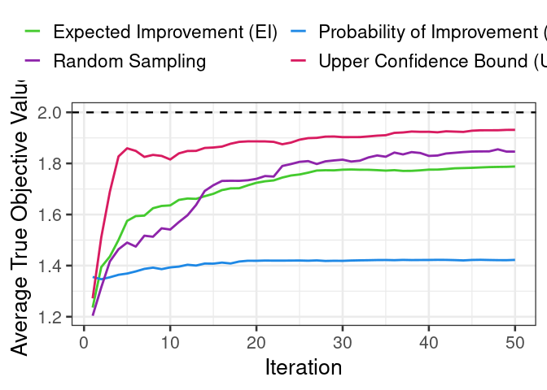

Bayesian Optimization Sequence
================
Rafael Izbicki

This notebook is part of the book “Machine Learning Beyond Point
Predictions: Uncertainty Quantification”, by Rafael Izbicki.

# Introduction

In this document, we will run a comparison of different acquisition
functions used in Bayesian optimization. Specifically, we will use
Expected Improvement (EI), Probability of Improvement (PI), Upper
Confidence Bound (UCB), and Random Sampling. The objective is to
understand how each acquisition function guides the search for the
optimal point in a noisy objective function.

# Required Libraries

First, we load the necessary libraries. We use `GauPro` for Gaussian
Process (GP) modeling, and `ggplot2` and `gridExtra` for visualization.

``` r
library(GauPro)
library(ggplot2)
library(gridExtra)
```

# Defining the Objective Function

The objective function we’re working with is a noisy sine-cosine wave.
This function takes an input `x` and adds Gaussian noise to simulate
real-world scenarios where measurements are noisy. We also define the
true (noiseless) objective function for later comparison.

``` r
objective <- function(x, noise = 0.5) {
  -sin(3 * x) - cos(2 * x) + noise * rnorm(length(x))
}

true_objective <- function(x) {
  -sin(3 * x) - cos(2 * x)
}
```

# Updating the GP Model

To update the Gaussian Process model with new points during the
optimization process, we define a helper function `update_gp`. This
function will be used to incorporate new points into the model after
each iteration.

``` r
update_gp <- function(gp_model, new_x, new_y) {
  new_x_mat <- matrix(new_x, ncol = 1)
  gp_model$update(Xnew = new_x_mat, Znew = new_y)
  return(gp_model)
}
```

# Optimization Process

Next, we define a function `optimize_gp` that performs the optimization.
This function will take a set of initial samples and iteratively use one
of the acquisition functions (EI, PI, UCB, or Random) to select new
points for evaluation.

Each iteration involves: 1. Predicting values at a grid of points using
the GP model. 2. Calculating the acquisition function for each point. 3.
Selecting the next point to evaluate based on the acquisition function.
4. Updating the GP model with the new point. 5. Recording the true
maximum value of the objective function at the chosen point.

``` r
optimize_gp <- function(n_iters, acquisition_func, x_initial, y_initial) {
  x_new <- seq(0.0, 5.0, length.out = 100)  # A grid of 100 points in [0, 5]
  x_new_mat <- matrix(x_new, ncol = 1)
  
  # Initialize the GP with the provided initial points
  x_initial_mat <- matrix(x_initial, ncol = 1)
  gp_model <- GauPro_kernel_model$new(X = x_initial_mat, 
                                      Z = y_initial, normalize = TRUE)
  
  # Store the true maximum values at each iteration
  true_max_values <- numeric(n_iters)
  
  for (i in 1:n_iters) {
    # Predict using the GP model
    pred <- gp_model$pred(XX = x_new_mat, se = TRUE)
    means <- pred$mean
    std_dev <- sqrt(pred$s2)
    which_best <- x_new_mat[which.max(means)]
    
    # Compute the acquisition function
    if (acquisition_func == "EI") {
      z <- (means - max(means)) / std_dev
      ei <- (means - max(means)) * pnorm(z) + std_dev * dnorm(z)
      next_x <- x_new[which.max(ei)]
    } else if (acquisition_func == "PI") {
      z <- (means - max(means)) / std_dev
      pi <- pnorm(z)
      next_x <- x_new[which.max(pi)]
    } else if (acquisition_func == "UCB") {
      ucb <- means + 5.0 * std_dev
      next_x <- x_new[which.max(ucb)]
    } else if (acquisition_func == "Random") {
      next_x <- runif(1, 0.0, 5.0)  # Random sampling in the interval [0, 5]
    }
    
    # Update the GP model with the new point
    new_y <- objective(next_x)
    gp_model <- update_gp(gp_model, next_x, new_y)
    
    # Store the true value of the objective function at the chosen point
    true_max_values[i] <- true_objective(which_best)
  }
  
  return(true_max_values)
}
```

# Running Multiple Experiments

To compare the performance of different acquisition functions, we define
the function `run_multiple_experiments`. This function runs the
optimization process multiple times with random initial points for each
method (EI, PI, UCB, and Random), and computes the average true
objective values across multiple runs.

``` r
run_multiple_experiments <- function(n_iters, n_repeats) {
  methods <- c("EI", "PI", "UCB", "Random")
  results <- matrix(0, nrow = n_iters, ncol = length(methods))
  colnames(results) <- methods
  
  for (method in methods) {
    # Initialize matrix to store results for each run
    all_runs <- matrix(0, nrow = n_repeats, ncol = n_iters)
    
    for (run in 1:n_repeats) {
      # Generate random initial points for each run
      n_initial <- 5  # Number of random initial points
      x_initial <- runif(n_initial, 0.0, 5.0)
      y_initial <- sapply(x_initial, true_objective)
      
      # Run the optimization process for the current method with random initial points
      all_runs[run, ] <- optimize_gp(n_iters, method, x_initial, y_initial)
    }
    
    # Compute the average for each iteration
    results[, method] <- colMeans(all_runs)
  }
  
  return(as.data.frame(results))
}
```

# Running the Experiments

We run the optimization process for 50 iterations and repeat it 200
times for each method. This will give us a robust comparison of how well
each acquisition function performs.

``` r
# Parameters
n_iters <- 50  # Number of iterations in each experiment
n_repeats <- 200  # Number of times to repeat the experiment

# Run the experiments and get average results with random initial points
average_results <- run_multiple_experiments(n_iters, n_repeats)

# Add an iteration column for plotting
average_results$Iteration <- 1:n_iters
```

# Visualization of the Results

Finally, we plot the average true objective value over iterations for
each acquisition function. We also plot the true maximum of the
noiseless objective function as a reference.

``` r
x_range <- seq(0, 5, length.out = 100)
true_max <- max(true_objective(x_range))

p <- ggplot(average_results, aes(x = Iteration)) +
  geom_line(aes(y = EI, color = "Expected Improvement (EI)"), linewidth = 1) +
  geom_line(aes(y = PI, color = "Probability of Improvement (PI)"), linewidth = 1) +
  geom_line(aes(y = UCB, color = "Upper Confidence Bound (UCB)"), linewidth = 1) +
  geom_line(aes(y = Random, color = "Random Sampling"), linewidth = 1) +
  geom_hline(aes(yintercept = true_max), linetype = "dashed", color = "black", linewidth = 0.8) +
  labs(y = "Average True Objective Value", x = "Iteration") +
  theme_bw(base_size = 20) +
  scale_color_manual(name = "Acquisition Function", 
                     values = c("Expected Improvement (EI)" = "#44CA2E", 
                                "Probability of Improvement (PI)" = "#1E88E5", 
                                "Upper Confidence Bound (UCB)" = "#D81B60",
                                "Random Sampling" = "#8E24AA")) +
  theme(
    legend.position = "top",  # Move legend to top
    legend.title = element_blank(),  # Remove legend title
    legend.text = element_text(size = 17)
  ) +
  guides(color = guide_legend(nrow = 2, byrow = TRUE))  # Split legend into 2 rows

p
```

<!-- -->
