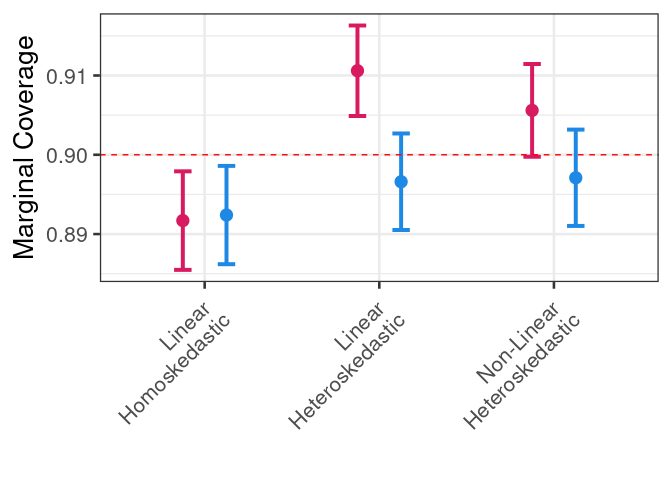
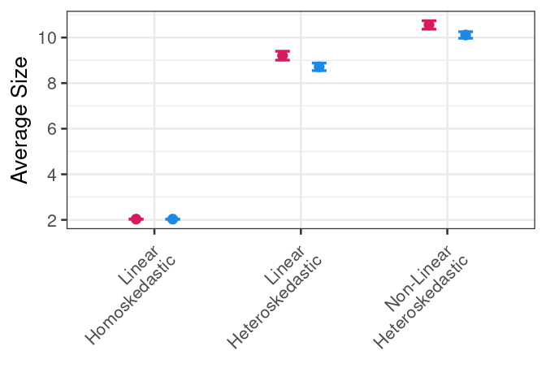

Conformal Prediction vs Linear Models
================
Rafael Izbicki

## Conformal Prediction and Linear Models

### Define Functions

``` r
library(ggplot2)
library(dplyr)
theme_set(theme_bw(base_size = 20))

conformal <- function(fit,xCal,yCal,alpha=0.1) {
  predictions <- predict(fit, xCal %>% as.data.frame())
  residuals <- abs(predictions - (yCal %>% as.matrix()))
  cutoff <- residuals[order(residuals)[ceiling((length(residuals)+1)*(1-alpha))]]
  output <- list(cutoff = cutoff, fit = fit)
  class(output) <- "conformal"
  return(output)
}

predict.conformal <- function(fit, xNew) {
  pred <- predict(fit$fit, xNew)
  if ("pred" %in% names(pred)) {
    pred = pred$pred 
  }
  lower <- pred - fit$cutoff
  upper <- pred + fit$cutoff
  return(list(pred = pred, lower = lower, upper = upper))
}
```

### Generate Data Function

``` r
generate_data <- function(n, d, residual_type = "gaussian") {
  x <- matrix(rnorm(n*d), n, d)
  if (residual_type == "gaussian") {
    y <- 2 * x[, 1] + rnorm(n, sd = 0.3)
  } else if (residual_type == "t") {
    y <- 2 * x[, 1] + rt(n, df = 2) * abs(x[, 1])/2
  } else if (residual_type == "t_5") {
    y <- sin(5*x[,2]) + rt(n, df = 2) * abs(x[, 1])/2
  }
  return(data.frame(x = x, y = y))
}
```

### Simulation Setup

``` r
set.seed(0)
num_iterations <- 10000
seeds <- sample(1:num_iterations, num_iterations, replace = FALSE)

summary_dfs <- list()
```

### Main Loop for Simulations

``` r
for (seed in seeds) {
  set.seed(seed)
  
  n <- 300
  ncal <- 100
  d <- 150
  
  # Gaussian residuals data
  x <- matrix(rnorm(n*d), n, d)
  data_gaussian <- generate_data(n, d, residual_type = "gaussian")
  
  # t residuals data with df=2
  x <- matrix(rnorm(n*d), n, d)
  data_t <- generate_data(n, d, residual_type = "t")
  
  # t residuals data with df=5
  x <- matrix(rnorm(n*d), n, d)
  data_t_5 <- generate_data(n, d, residual_type = "t_5")
  
  # Test data
  n_test <- 1
  x <- matrix(rnorm(n_test*d), n_test, d)
  data_test_gaussian <- generate_data(n_test, d, residual_type = "gaussian")
  data_test_t <- generate_data(n_test, d, residual_type = "t")
  data_test_t_5 <- generate_data(n_test, d, residual_type = "t_5")
  
  # Split the data into training and calibration sets
  train_indices <- sample(seq_len(n), size = n - ncal)
  train_data_gaussian <- data_gaussian[train_indices, ]
  calibration_data_gaussian <- data_gaussian[-train_indices, ]
  
  train_data_t <- data_t[train_indices, ]
  calibration_data_t <- data_t[-train_indices, ]
  
  train_data_t_5 <- data_t_5[train_indices, ]
  calibration_data_t_5 <- data_t_5[-train_indices, ]
  
  # Linear model and predictions for all cases
  fit_gaussian <- lm(y ~ ., data = train_data_gaussian)
  fit_t <- lm(y ~ ., data = train_data_t)
  fit_t_5 <- lm(y ~ ., data = train_data_t_5)
  
  # Gaussian residual predictions
  pred_lm_exact_gaussian <- predict(fit_gaussian, data_test_gaussian, interval = "prediction", level = 0.9) %>% 
    as.data.frame()
  pred_lm_exact_gaussian$y <- data_test_gaussian$y
  
  fitted_lm_conformal_gaussian <- conformal(fit_gaussian, calibration_data_gaussian %>% select(-y), calibration_data_gaussian %>% select(y), alpha = 0.1)
  pred_lm_conformal_gaussian <- predict(fitted_lm_conformal_gaussian, data_test_gaussian %>% select(-y)) %>% as.data.frame()
  pred_lm_conformal_gaussian$y <- data_test_gaussian$y
  
  # t residual predictions
  pred_lm_exact_t <- predict(fit_t, data_test_t, interval = "prediction", level = 0.9) %>% 
    as.data.frame()
  pred_lm_exact_t$y <- data_test_t$y
  
  fitted_lm_conformal_t <- conformal(fit_t, calibration_data_t %>% select(-y), calibration_data_t %>% select(y), alpha = 0.1)
  pred_lm_conformal_t <- predict(fitted_lm_conformal_t, data_test_t %>% select(-y)) %>% as.data.frame()
  pred_lm_conformal_t$y <- data_test_t$y
  
  # t (df=5) residual predictions
  pred_lm_exact_t_5 <- predict(fit_t_5, data_test_t_5, interval = "prediction", level = 0.9) %>% 
    as.data.frame()
  pred_lm_exact_t_5$y <- data_test_t_5$y
  
  fitted_lm_conformal_t_5 <- conformal(fit_t_5, calibration_data_t_5 %>% select(-y), calibration_data_t_5 %>% select(y), alpha = 0.1)
  pred_lm_conformal_t_5 <- predict(fitted_lm_conformal_t_5, data_test_t_5 %>% select(-y)) %>% as.data.frame()
  pred_lm_conformal_t_5$y <- data_test_t_5$y
  
  # Combine predictions and add labels
  pred_lm_exact_gaussian$residual_type <- "Gaussian residuals"
  pred_lm_exact_gaussian$method <- "Linear Model"
  pred_lm_conformal_gaussian$residual_type <- "Gaussian residuals"
  pred_lm_conformal_gaussian$method <- "Conformal (calibration size = 100)"
  
  pred_lm_exact_t$residual_type <- "t residual (df=2)"
  pred_lm_exact_t$method <- "Linear Model"
  pred_lm_conformal_t$residual_type <- "t residual (df=2)"
  pred_lm_conformal_t$method <- "Conformal (calibration size = 100)"
  
  pred_lm_exact_t_5$residual_type <- "t residual (df=5)"
  pred_lm_exact_t_5$method <- "Linear Model"
  pred_lm_conformal_t_5$residual_type <- "t residual (df=5)"
  pred_lm_conformal_t_5$method <- "Conformal (calibration size = 100)"
  
  # Ensure the column names of all data frames are consistent
  colnames(pred_lm_exact_gaussian) <- colnames(pred_lm_conformal_gaussian) <- 
    c("fit", "lower", "upper", "y", "residual_type", "method")
  
  colnames(pred_lm_exact_t) <- colnames(pred_lm_conformal_t) <- 
    c("fit", "lower", "upper", "y", "residual_type", "method")
  
  colnames(pred_lm_exact_t_5) <- colnames(pred_lm_conformal_t_5) <- 
    c("fit", "lower", "upper", "y", "residual_type", "method")
  
  # Combine the Gaussian, t (df=2), and t (df=5) residual data frames
  combined_df_gaussian <- rbind(pred_lm_exact_gaussian, pred_lm_conformal_gaussian)
  combined_df_t <- rbind(pred_lm_exact_t, pred_lm_conformal_t)
  combined_df_t_5 <- rbind(pred_lm_exact_t_5, pred_lm_conformal_t_5)
  
  # Combine all data
  combined_df <- rbind(combined_df_gaussian, combined_df_t, combined_df_t_5)
  
  combined_df$method <- factor(combined_df$method, 
                               levels = c("Linear Model", 
                                          "Conformal (calibration size = 100)"))
  
  summary <- combined_df %>% 
    group_by(method, residual_type) %>% 
    summarise(coverage = mean(lower < y & upper > y), size = mean(upper - lower))
  
  # Add the combined_df object to the list
  summary_dfs[[paste0("iteration_", seed)]] <- summary
}


combined_df <- bind_rows(summary_dfs, .id = "iteration")
```

### Summarize Results

``` r
df <- combined_df %>% 
  group_by(method, residual_type) %>% 
  summarise(coverage_mean = mean(coverage),
            coverage_se = sqrt(var(coverage) / length(seeds)),
            size_mean = mean(size),
            size_se = sqrt(var(size) / length(seeds)))
```

### Coverage Plot

``` r
ggplot(df, aes(x = residual_type, y = coverage_mean, color = method)) +
  geom_point(position = position_dodge(width = 0.5), size = 4) +
  geom_errorbar(aes(ymin = coverage_mean - 2 * coverage_se, ymax = coverage_mean + 2 * coverage_se),
                position = position_dodge(0.5), width = 0.2, linewidth = 1.4) +
  labs(x = "", y = "Marginal Coverage") +
  theme(legend.position = "none",
        axis.text.x = element_text(angle = 45, hjust = 1),
        legend.title = element_blank()) +
  geom_hline(yintercept = 0.90, linetype = "dashed", color = "red") +
  scale_color_manual(values = c("#D81B60", "#1E88E5"),
                     labels = c("Linear Model Interval",
                                "Conformal \n(calibration size: 100)")) +
  scale_x_discrete(labels = c("Gaussian residuals" = "Linear \nHomoskedastic", 
                              "t residual (df=2)" = "Linear \nHeteroskedastic", 
                              "t residual (df=5)" = "Non-Linear \nHeteroskedastic"))
```

<!-- -->

### Size Plot

``` r
ggplot(df, aes(x = residual_type, y = size_mean, color = method)) +
  geom_point(position = position_dodge(width = 0.5), size = 4) +
  geom_errorbar(aes(ymin = size_mean - 2 * size_se, ymax = size_mean + 2 * size_se),
                position = position_dodge(0.5), width = 0.2, linewidth = 1.2) +
  labs(x = "", y = "Average Size") +
  theme(axis.text.x = element_text(angle = 45, hjust = 1),
        legend.title = element_blank(), legend.position = "none") +
  scale_color_manual(values = c("#D81B60", "#1E88E5"),
                     labels = c("Linear Model Interval",
                                "Conformal \n(calibration size: 100)")) +
  scale_x_discrete(labels = c("Gaussian residuals" = "Linear \nHomoskedastic", 
                              "t residual (df=2)" = "Linear \nHeteroskedastic", 
                              "t residual (df=5)" = "Non-Linear \nHeteroskedastic"))
```

<!-- -->
