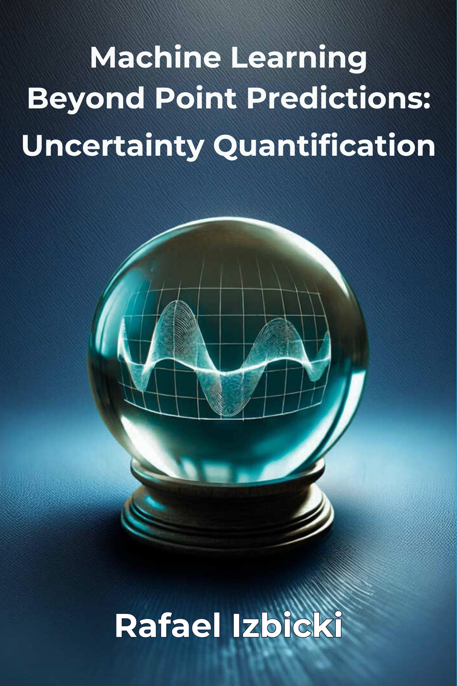

This is the github repository for the book **Machine Learning Learning Beyond Point Predictions: Uncertainty Quantification**, by [Rafael Izbicki](https://rafaelizbicki.com).  

[Check the book here](https://rafaelizbicki.com/uq4ml).

  

